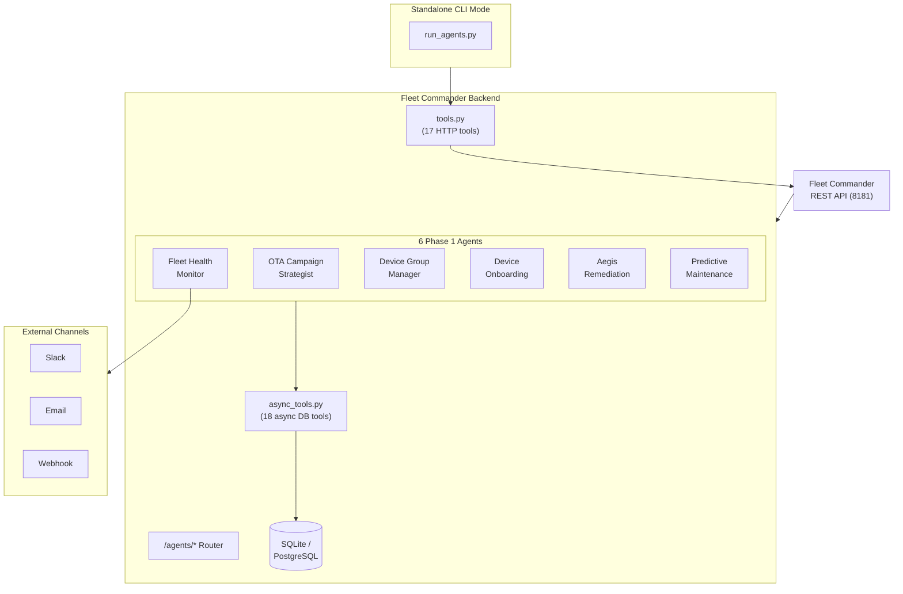
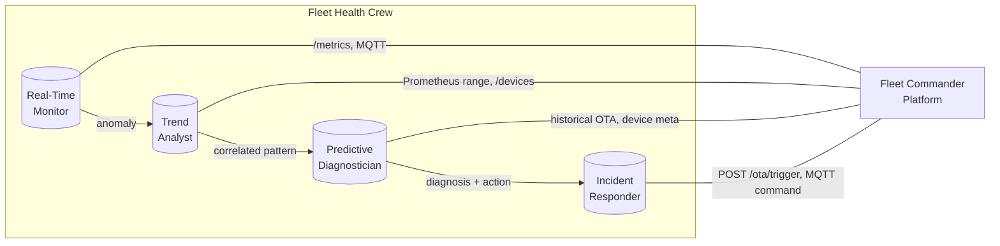
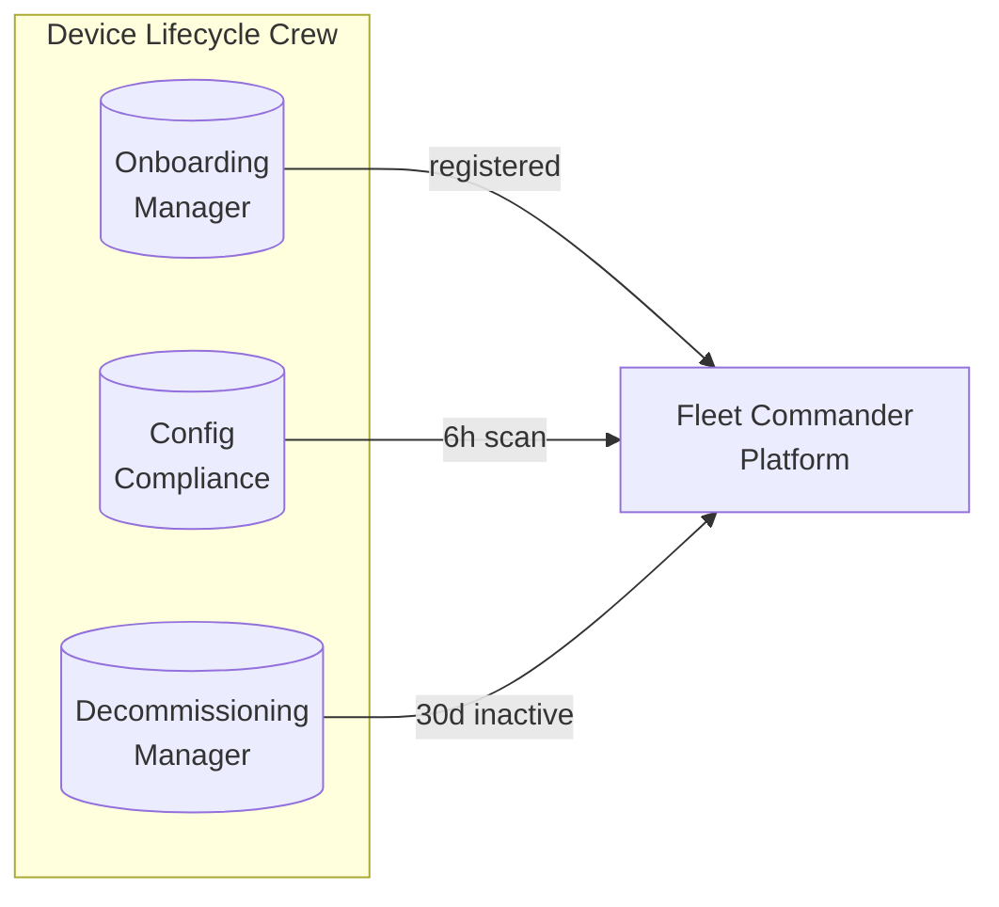
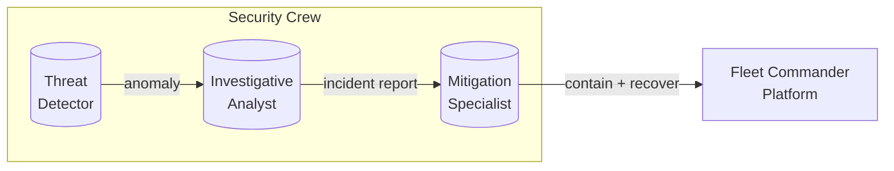
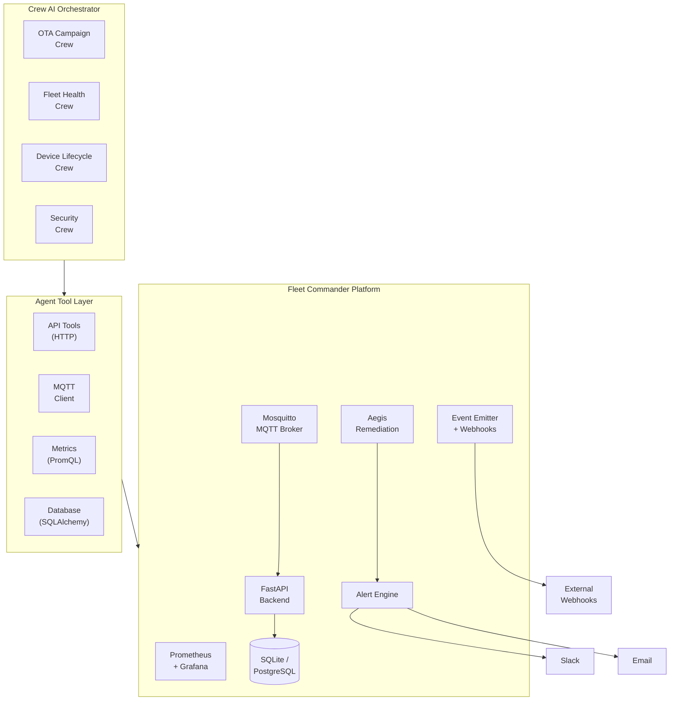
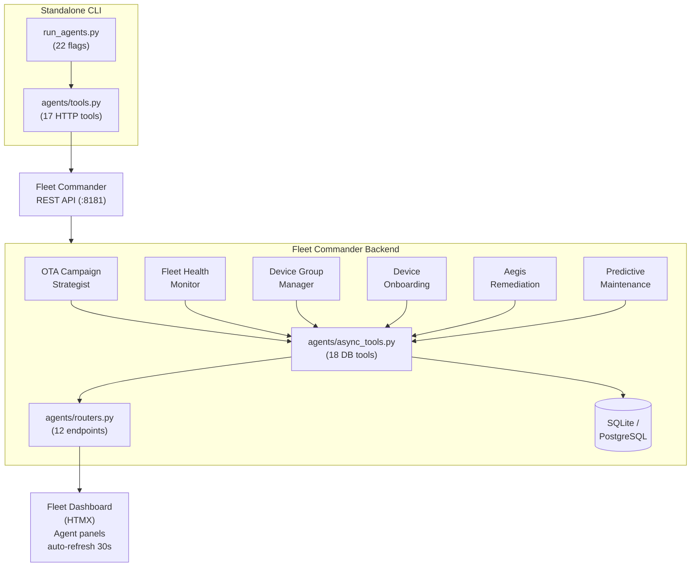
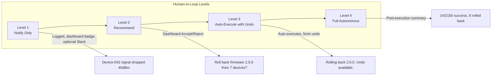

# Fleet Commander — AI / Agentic Use Cases

## Overview

This document maps Crew AI agentic use cases onto the Fleet Commander platform. It covers:

1. **Phase 1 implementation** — Six running agent crews (OTA, Anomaly, Groups, Onboarding, Aegis Remediation, Predictive Maintenance)
2. **Proposed agent crews** with detailed task breakdowns for future phases
3. **Future roadmap** for fully autonomous fleet operations

---

## 1. Current Platform Capabilities (Agent-Ready)

These existing Fleet Commander features provide the data surfaces and action primitives that AI agents can consume and control.

| Capability | Data / Action Surface | Consumable By Agent |
|---|---|---|
| Device registration & heartbeat | `GET /devices` — status, uptime, signal, city, lifecycle | Fleet Monitor Agent |
| Telemetry time-series | `GET /telemetry/{id}` — signal, temp, CPU, SOC trends | Predictive Maintenance |
| Firmware upload + Ed25519 signing | `POST /ota/upload` — SHA256, signature, signing key | OTA Manager Agent |
| OTA trigger (targeted/bulk) | `POST /ota/trigger` — deployment_ids | OTA Manager Agent |
| OTA status tracking + timeout recovery | `GET /ota/status` — state machine transitions | OTA Manager Agent |
| Scheduled OTA with blackout windows | `POST /ota/schedules` — canary %, blackout hours | OTA Campaign Agent |
| Automatic rollback on hash mismatch | State machine: `hash_mismatch → rollback → rolled_back` | Self-Healing Agent |
| MQTT command publishing | `iot/fleet/{id}/command/{ota,config,restart,rollback,shadow}` | Any agent |
| Device shadow / digital twin | `GET/PUT /shadow/{id}` — desired vs reported state | Lifecycle Agent |
| Offline command queue | `POST /commands/queue` — queued until device reconnects | Fleet Monitor Agent |
| Device lifecycle (active/maintenance/decommissioned) | `POST /lifecycle/{id}/decommission` — claim token, QR | Onboarding Agent |
| Geofences & geo-alerts | `POST /geofences` — circle/polygon, enter/exit events | Fleet Monitor Agent |
| Predictive failure scoring | `POST /predictive/scan` — risk score per device | Predictive Agent |
| Aegis auto-remediation | `GET /aegis/scan` — 8 rules, DLQ, dry-run | Aegis Remediation Agent |
| Alert engine with dedup | `GET /alerts` — active/acknowledged/resolved, multi-channel | Fleet Health Agent |
| Fleet health alert triggers | `GET /agents/fleet-health` — fires alerts for anomalies | Fleet Health Agent |
| V2G arbitrage with real spot prices | `GET /agents/v2g-dispatch` — revenue net of degradation | V2G Optimizer |
| Prometheus metrics | `GET /metrics/` — 30+ metrics | Monitoring Agent |
| Audit log | `GET /audit` — full traceability (who, what, when) | Compliance Agent |
| Webhook/event stream | `POST /webhooks` — HMAC-signed event notifications | Event Agent |
| Bulk CSV import + QR-claim provisioning | `POST /provisioning/bulk-import` — pre-register, claim | Provisioning Agent |
| Grafana dashboards | JSON dashboard model | Reporting Agent |
| **Agent Recommendations** | `GET /agents/*` — OTA plans, anomaly checks, device groups, onboarding, predictive scans, V2G dispatch | Human-in-loop interface |

### Key Data Points for Agents

```
Device:
  {id, name, firmware_version, status, signal_strength, last_seen,
   uptime_percentage, previous_firmware_version, mqtt_client_id,
   city, latitude, longitude, soc, soh, battery_temp, plug_status,
   lifecycle_status, claim_token}

Deployment:
  {id, firmware_id, device_id, status, retry_count, error_message,
   created_at, updated_at}

Telemetry:
  {device_id, timestamp, signal_strength, temperature, cpu_usage,
   memory_usage, voltage, current, soc, soh, location_lat, location_lng}

Geofence:
  {id, name, shape, center_lat, center_lng, radius_meters,
   alert_on_enter, alert_on_exit}

CommandQueue:
  {id, device_id, command_type, payload, status, ttl_seconds,
   delivered_at}

DeviceShadow:
  {id, device_id, state, version, desired_payload, reported_payload}

PredictedFailure:
  {id, device_id, risk_type, risk_score, predicted_at, resolved}

V2gSchedule:
  {id, device_id, action, power_kw, start_time, end_time, spot_price}

Metrics:
  fleet_active_devices, fleet_ota_deployments_total{status},
  fleet_api_request_latency_seconds, fleet_mqtt_messages_*,
  fleet_alerts_active, telemetry_points_total, command_queue_depth,
  device_lifecycle_transitions, shadow_updates_total
```

---

## 2. Phase 1 — Assisted Mode (Implemented)

Six AI agent crews are implemented and running. All run in **tool-only mode** (no LLM dependency) by default, with optional Crew AI LLM integration via `--llm` flag.

### Architecture



**Dual execution mode:**
- **In-backend**: Agent tools query the database directly via SQLAlchemy (`agents/async_tools.py`) to avoid self-referencing HTTP deadlocks
- **Standalone CLI**: Same tools use HTTP (`agents/tools.py`) when run outside the container
- **LLM mode**: Pass `--llm` (or set `CREWAI_ENABLED=1`) to use Crew AI with `Agent`/`Task`/`Crew` objects for natural-language reasoning

### Agent 1: OTA Campaign Strategist

Suggests a phased rollout plan with canary group, rollout phases, and gate criteria.

**Endpoint:** `GET /agents/ota-campaign?firmware_version=2.0.0`

**Heuristic logic:**
1. Fetch online devices and target firmware
2. Select 1 canary device (lowest signal strength → conservative pick)
3. Define 3 rollout phases with gate criteria:
   - Phase 1: canary (1 device, 120s monitor, <20% failure gate)
   - Phase 2: 30% of remaining (failure rate < 20% gate)
   - Phase 3: 100% (final — no gate)
4. Assess risk based on firmware size, device count, prior failure rate

**Response (example):**
```json
{
  "agent": "OTA Campaign Strategist",
  "type": "ota_campaign",
  "summary": "Deploy firmware 2.0.0 to 1 canary devices first. Monitor for 120s.",
  "details": {
    "firmware": {"id": "...", "version": "2.0.0"},
    "total_online_devices": 5,
    "canary_group": {
      "device_count": 1,
      "monitor_duration_seconds": 120,
      "pass_criteria": "failure_rate < 20% AND no critical anomalies"
    },
    "rollout_phases": [
      {"phase": "Phase 1", "device_count": 1, "gate": "canary_ok"},
      {"phase": "Phase 2", "device_count": 2, "gate": "failure_rate < 20%"},
      {"phase": "Phase 3", "device_count": 2, "gate": "No gate (final phase)"}
    ],
    "risk_assessment": {"level": "low", "note": "5 online devices, firmware 2.0.0 is 1.2MB"}
  },
  "human_input_required": true
}
```

### Agent 2: Fleet Health Monitor

Scans the fleet for anomalies: weak signals, stuck OTAs, failure spikes, mass offline events. Fires alerts through the Alert Engine with dedup, cooldown, and multi-channel delivery.

**Endpoint:** `GET /agents/anomaly-check?notify=false`
**Endpoint (with alert engine):** `GET /agents/fleet-health`

**Heuristic checks:**
1. Devices with signal_strength < -90 dBm → warning
2. OTA deployments stuck in downloading/applying/verifying → critical
3. OTA failure rate > 30% (when total >= 5) → critical
4. More than 30% of devices offline → critical

**Alert types:**
| Anomaly | Alert Type | Dedup Key | Severity |
|---|---|---|---|
| Weak signal (< -90 dBm) | `device_offline` | `{device_id}` | warning |
| Stuck OTA | `ota_stuck` | `{deployment_id}` | critical |
| High failure rate (> 30%) | `ota_failure_spike` | `ota_failure_spike` | critical |
| Mass offline (> 30%) | `device_offline` | `mass_offline` | critical |
| V2G revenue negative | `v2g_revenue_drop` | `v2g_revenue` | warning |

**Notifications:** Sends alerts via Slack webhook, SMTP email, or generic webhook based on env config.

### Agent 3: Device Group Manager

Suggests device groupings by firmware version, signal strength, and city/location with rationale.

**Endpoint:** `GET /agents/device-groups?min_group_size=3`

**Grouping dimensions:**
- **Firmware version** — same-firmware cohorts for OTA targeting
- **Signal strength buckets** — good (>= -60), moderate (-60 to -80), poor (< -80) dBm
- **City** — location-based cohorts (requires simulator to send `city` field)

### Agent 4: Device Onboarding Agent

Guides the process of introducing a new device into the fleet: validates identity, checks for conflicts, recommends firmware, and optionally auto-registers.

**Endpoint:** `GET /agents/onboarding?name=Sensor-042&firmware_version=2.0.0&auto_register=true`

**Heuristic logic:**
1. **Name conflict check** — scans existing devices for duplicate names
2. **MQTT client ID conflict check** — scans existing devices for duplicate `mqtt_client_id`
3. **IP address conflict check** — warns if IP is already in use
4. **Firmware recommendation** — suggests latest firmware from registry
5. **Auto-registration** — if `auto_register=true`, registers the device directly via DB

**Response (example):**
```json
{
  "agent": "Device Onboarding Agent",
  "type": "device_onboarding",
  "summary": "Device Sensor-042 can be onboarded with firmware 2.0.0.",
  "checks": {
    "name_conflict": false,
    "mqtt_client_id_conflict": false,
    "ip_conflict": false,
    "recommended_firmware": "2.0.0"
  },
  "auto_register": true,
  "registration_result": {"id": "...", "status": "registered"},
  "human_input_required": false
}
```

**CLI:**
```bash
python run_agents.py --onboard "Sensor-042" --onboard-firmware 2.0.0 --onboard-auto
python run_agents.py --onboard "Sensor-042" --onboard-mqtt-id "sensor-042-mqtt" --onboard-ip "10.0.1.50"
```

### Agent 5: Aegis Auto-Remediation Agent

Scans the fleet for resource pressure signals and applies configurable remediation rules with dead-letter queue and dry-run mode.

**Endpoint:** `GET /agents/aegis/scan`

**8 Remediation Rules:**
| Rule | Signal | Action |
|---|---|---|
| `r001_pressure_notify` | fleet_active_devices < threshold | Log warning, escalate to human |
| `r002_device_offline` | Device offline > 5 min | Push MQTT restart command |
| `r003_ota_high_failure` | OTA failure rate > 30% | Notify fleet manager via alert |
| `r004_scale_heartbeat` | Active devices = 0 (startup) | Log info, no action needed |
| `r005_ota_stuck` | OTA in-progress > timeout | Retry OTA or mark as failed |
| `r006_latency_spike` | API latency > 500ms | Log warning, notify ops |
| `r007_signal_degraded` | Avg signal < -85 dBm across fleet | Flag for RF inspection |
| `r008_predictive_risk` | Predictive risk > 0.7 | Schedule maintenance window |

**Features:**
- Cooldown per rule (configurable — default 600s)
- Dead-letter queue for failed actions
- Dry-run mode (`AEGIS_DRY_RUN=true`)
- Full audit trail via Audit Log
- Prometheus metrics: `aegis_remediations_total{status,rule}`

### Agent 6: Predictive Maintenance Agent

Analyzes telemetry trends to predict device failures before they happen.

**Endpoint:** `POST /agents/predictive-scan`

**Heuristic logic (per device):**
1. **Signal trend** — linear regression on last 50 signal readings; if slope < -1.0 → `signal_degradation` risk
2. **Temperature trend** — if slope > 0.5 → `thermal_risk`
3. **CPU trend** — if slope > 1.0 → `cpu_pressure`
4. **Memory trend** — if slope > 1.0 → `memory_pressure`
5. **Composite score** — weighted average of all trend slopes → `risk_score` (0.0–1.0)

**Response (example):**
```json
{
  "agent": "Predictive Maintenance Agent",
  "type": "predictive_scan",
  "predictions_count": 3,
  "predictions": [
    {
      "device_id": "...",
      "risk_type": "signal_degradation",
      "risk_score": 0.72,
      "trend_details": {"signal": "slope=-1.3 dBm/reading"}
    }
  ],
  "human_input_required": false
}
```

### Combined Endpoint

**`GET /agents/recommendations?notify=false`** — runs all six agents in parallel and returns combined results. Consumed by the dashboard.

### Optional V2G Arbitrage Optimizer

Although not a Crew AI agent, the V2G optimizer runs as an agent-style endpoint:

**Endpoint:** `GET /agents/v2g-dispatch?horizon_hours=12`

Optimizes EV battery charge/discharge schedule using real or mock spot prices, with degradation cost modeled via Arrhenius equation:

```
deg_cost = battery_replacement_cost × (power / capacity) × Δt ×
           exp(-Ea / (R × (temp + 273.15)))
```

### Optional Crew AI LLM Mode

Set `CREWAI_ENABLED=1` and install `crewai` to use LLM-powered agents:

```bash
pip install crewai
python run_agents.py --ota --llm  # Uses LLM for reasoning
```

Crew AI agents are defined in `agents/phase1_crew.py` with proper `Agent`, `Task`, and `Crew` objects, `human_input=True` gates, and tool bindings.

### File Structure

```
fleet-management/
├── agents/
│   ├── __init__.py           # Package init
│   ├── tools.py              # 17 HTTP-based tools (standalone CLI usage)
│   ├── async_tools.py        # 18 async DB-backed tools (in-backend usage)
│   ├── phase1_crew.py        # 7 agent runners (OTA, Anomaly, Groups,
│   │                         #   Onboarding, Remediation, Predictive, All)
│   └── routers.py            # FastAPI router, 12 endpoints under /agents/*
├── app/
│   ├── alert_engine.py       # Alert dedup, cooldown, multi-channel notify
│   ├── aegis/                # 8 remediation rules, DLQ, dry-run mode
│   ├── predictive_maintenance.py  # Telemetry trend analysis
│   ├── v2g_optimizer.py      # V2G arbitrage with degradation model
│   ├── firmware_signing.py   # Ed25519 keygen/sign/verify
│   ├── geofence_checker.py   # Haversine + polygon containment
│   ├── event_emitter.py      # Webhook event fan-out with HMAC
│   ├── spot_prices.py        # Real spot-price provider abstraction
│   └── audit.py              # Audit log helper
└── run_agents.py             # CLI runner (22 flags)
```

### Quick Start

```bash
# Dashboard shows agent recommendations (auto-refresh every 30s)
docker compose --profile demo up -d
open http://localhost:8000

# CLI: full recommendation report
python run_agents.py

# CLI: specific agents
python run_agents.py --ota
python run_agents.py --anomaly
python run_agents.py --groups
python run_agents.py --onboard "Sensor-042" --onboard-auto
python run_agents.py --v2g --horizon 12
python run_agents.py --fleet-health
python run_agents.py --predictive
python run_agents.py --remediate

# CLI: JSON output for programmatic use
python run_agents.py --json

# CLI: with LLM reasoning
python run_agents.py --ota --llm
```

---

## 3. Proposed Crew AI Agent Crews (Future Phases)

### Crew A — OTA Campaign Manager

**Goal:** Autonomous OTA rollout with canary analysis, gradual rollout, and automatic rollback decisions.

```mermaid
flowchart LR
    subgraph CrewA["OTA Campaign Crew"]
        OS[("OTA Strategist<br/>(lead)")]
        CA[("Canary Analyzer")]
        RE[("Rollout Executor")]
        RC[("Rollback Commander")]

        OS -->|plan: firmware + canary| CA
        CA -->|go/no-go| RE
        RE -->|phase gate check| CA
        RE -->|failure detected| RC
    end

    OS ---|GET /devices, GET /ota/firmware| API1["Fleet Commander API"]
    CA ---|GET /devices, GET /ota/status| API1
    RE ---|POST /ota/trigger| API1
    RC ---|POST /ota/trigger (rollback)| API1
```

- **OTA Strategist (lead):** Plans the rollout campaign — select target firmware, compute canary group (10%), define rollback criteria (>=2 failures → abort)
- **Canary Analyzer:** Monitors canary group health — after deploy, analyze for N minutes; if failure_rate > threshold → abort + rollback; if all success → proceed
- **Rollout Executor:** Executes phased rollout — 30% → wait → 60% → wait → 100%; each phase calls Canary Analyzer for gate check
- **Rollback Commander:** Reverts all devices to previous known-good firmware; logs incident with full timeline

### Crew B — Fleet Health & Anomaly Detection

**Goal:** Real-time monitoring across 3 horizons (real-time, trend, predictive).



- **Real-Time Monitor:** Watches live fleet metrics every 30s via `/metrics`; signals: device goes offline, OTA failure spike, signal strength drops across cohort
- **Trend Analyst:** Analyzes 1h/24h/7d trends via Prometheus range queries and device state diffs; signals: gradual uptime decline, regional signal degradation
- **Predictive Diagnostician:** Correlates signals to diagnose root cause; e.g., "Devices on firmware 1.2.0 have 3x higher offline rate than those on 1.1.0"
- **Incident Responder:** Executes automated mitigations — isolate malfunctioning cohort, trigger rollback, notify admin

**Example Anomaly Scenario:**
```
1. Real-Time Monitor detects signal_strength of Device-042 drops
   from -55dBm to -90dBm over 5 minutes
2. Trend Analyst confirms: same pattern on 6 other devices
   on same firmware version
3. Predictive Diagnostician correlates: all 7 devices received
   OTA to firmware 2.0.0 in last hour
4. Incident Responder: triggers rollback of 2.0.0 for the cohort,
   publishes remote config to reduce TX power
5. OTA Campaign Manager (Crew A) notified: add firmware 2.0.0
   to blocklist, flag for engineering review
```

### Crew C — Device Lifecycle Management (Partially Implemented)

**Goal:** Autonomous device onboarding, provisioning, and retirement.



| Agent | Status | Notes |
|---|---|---|
| **Onboarding Manager** | ✅ **Implemented** (Agent 4) | Device Onboarding Agent — conflict check + firmware recommend + auto-register |
| **Config Compliance** | 🔄 Future | Fleet-wide config drift detection and remediation |
| **Decommissioning Manager** | 🟡 Partial | Lifecycle endpoints exist (`POST /lifecycle/{id}/decommission`); agent wrapper is future |

### Crew D — Security Incident Response

**Goal:** Detect and respond to security threats across the fleet.



- **Threat Detector:** Identifies anomalous behavior — rapid register/deregister cycling, heartbeats from unexpected geographies, OTA hash mismatch rate exceeds threshold, unexpected MQTT topic access
- **Investigative Analyst:** Deep-dives into flagged anomalies via device history, OTA timeline, and MQTT log correlation; outputs incident report with severity, timeline, and recommended actions
- **Mitigation Specialist:** Executes containment and recovery — quarantine compromised devices, block affected firmware version, force rollback, notify IR team

---

## 4. Agent Integration Architecture

### How Crew AI Connects to Fleet Commander



### Phase 1 Specific Architecture



### Tool Definitions

Each Crew AI agent needs tools that wrap Fleet Commander's API. Here are the core tool signatures (HTTP versions from `agents/tools.py`):

```python
from crewai.tools import tool
import requests

BASE = "http://localhost:8000"

@tool("List Devices")
def list_devices(status: str = None) -> list:
    """Fetch all devices, optionally filtered by status (online/offline)"""
    params = {"status": status} if status else {}
    resp = requests.get(f"{BASE}/devices", params=params)
    return resp.json()["devices"]

@tool("Trigger OTA")
def trigger_ota(firmware_id: str, device_ids: list[str] = None,
                all_devices: bool = False) -> dict:
    """Trigger an OTA firmware update for target devices"""
    payload = {"firmware_id": firmware_id, "all_devices": all_devices}
    if device_ids:
        payload["device_ids"] = device_ids
    resp = requests.post(f"{BASE}/ota/trigger", json=payload)
    return resp.json()

@tool("Get OTA Status")
def get_ota_status() -> dict:
    """Get status of all OTA deployments with success/fail counts"""
    resp = requests.get(f"{BASE}/ota/status")
    return resp.json()

@tool("Query Metrics")
def query_metrics(query: str) -> list:
    """Run a PromQL query against the /metrics endpoint"""
    resp = requests.get(f"{BASE}/metrics")
    text = resp.text
    results = []
    for line in text.splitlines():
        if line.startswith(query) or query in line:
            results.append(line)
    return results

@tool("Push Remote Config")
def push_config(device_id: str, config: dict) -> bool:
    """Push a remote configuration to a device via MQTT"""
    resp = requests.post(f"{BASE}/devices/{device_id}/config", json=config)
    return resp.status_code == 200

@tool("Onboard Device")
def onboard_device(name: str, firmware_version: str = None,
                   auto_register: bool = False) -> dict:
    """Onboard a new device with conflict checking and firmware recommendation"""
    params = {"name": name}
    if firmware_version: params["firmware_version"] = firmware_version
    if auto_register: params["auto_register"] = "true"
    resp = requests.get(f"{BASE}/agents/onboarding", params=params)
    return resp.json()

@tool("Run Predictive Scan")
def run_predictive_scan() -> dict:
    """Run predictive maintenance analysis on all device telemetry"""
    resp = requests.post(f"{BASE}/agents/predictive-scan")
    return resp.json()

@tool("Run Aegis Scan")
def run_aegis_scan() -> dict:
    """Run the Aegis auto-remediation engine scan"""
    resp = requests.get(f"{BASE}/agents/aegis/scan")
    return resp.json()
```

---

## 5. Future Roadmap with AI/Agents

### Phase 1 — Assisted (Implemented)

| Feature | Description | Value | Status |
|---|---|---|---|
| OTA Campaign Dashboard | Dashboard UI shows agent-recommended rollout plan | Human approves, agent executes | ✅ Live |
| Anomaly Alerts + Alert Engine | Agent detects anomalies, fires alerts via Slack/Email/Webhook with dedup | Faster incident response | ✅ Live |
| Device Group Manager | Agent suggests device groupings by firmware/signal/city | Better targeting | ✅ Live |
| Device Onboarding Agent | Agent validates identity, checks conflicts, recommends firmware | Zero-friction fleet expansion | ✅ Live |
| Fleet Health Agent | Agent runs fleet-wide health check, triggers alert engine | Proactive monitoring | ✅ Live |
| Aegis Auto-Remediation | 8 rules auto-heal fleet issues with DLQ and dry-run | Reduced MTTR | ✅ Live |
| Predictive Maintenance | Agent predicts failures via telemetry trend analysis | Prevent incidents before they happen | ✅ Live |
| V2G Arbitrage Optimizer | Agent optimizes charge/discharge with real spot prices | Revenue optimization | ✅ Live |

### Phase 2 — Semi-Autonomous (3–6 months)

| Feature | Description | Value |
|---|---|---|
| Canary Auto-Promote | Agent runs canary, auto-promotes to full rollout if healthy | Zero-touch OTA for low-risk updates |
| Self-Healing Fleet | Agent detects offline device cohort, auto-triggers recovery | Reduced MTTR |
| Predictive Rollback | Agent predicts OTA failure risk based on historical patterns | Prevent incidents before they happen |
| Fleet Capacity Planner | Agent analyzes growth, recommends scaling backend/MQTT | Cost-optimized infrastructure |

### Phase 3 — Autonomous (6–12 months)

| Feature | Description | Value |
|---|---|---|
| Fully Autonomous OTA | Agent manages end-to-end: plan → canary → rollout → verify → rollback if needed | Hands-off fleet updates |
| Cross-Fleet Optimization | Agent learns optimal OTA parameters (batch size, delay, time-of-day) per device cohort | Maximized success rate |
| Security Auto-Response | Agent detects zero-day, quarantines affected devices, prepares emergency patch | Containment in minutes |
| Natural Language Fleet Ops | "Roll back firmware 2.0.0 from all devices in Europe" → agent plans and executes | LLM-driven fleet management |

### Phase 4 — Predictive & Generative (12+ months)

| Feature | Description | Value |
|---|---|---|
| Generative Firmware Patches | Agent generates hotfix firmware for critical CVEs | Patch in hours, not weeks |
| Predictive Device Health | Agent predicts device failure 7 days in advance using ML on telemetry data | Proactive maintenance |
| AI Fleet Twin | Digital twin of the fleet running simulations before real rollout | Zero-risk OTA planning |
| Multi-Fleet Orchestration | Agent manages across multiple independent fleets with shared policies | Unified management at scale |

---

## 6. Human-in-Loop Design

All autonomous actions include human-in-loop gates:



**Level 1 — Notify Only**
```
Agent: "Device-042 signal dropped 40dBm"
→ Logged, dashboard badge, optional Slack
```

**Level 2 — Recommend**
```
Agent: "Recommended: roll back firmware 2.0.0 from 7 affected devices"
→ Dashboard notification with Accept/Reject buttons
```

**Level 3 — Auto-Execute with Undo**
```
Agent: "Rolling back firmware 2.0.0 from 7 devices. Undo available for 5 minutes."
→ Auto-executes, undo button on dashboard
```

**Level 4 — Full Autonomous**
```
Agent: "OTA campaign completed: 142/150 success, 8 rolled back. Report generated."
→ Post-execution summary only
```

Each Crew AI task specifies its human-in-loop level:

```python
canary_analysis = Task(
    description="Analyze canary group health for OTA deployment",
    expected_output="Go/No-Go recommendation with evidence",
    agent=canary_analyzer,
    human_input=True,  # Requires human approval before next phase
)
```

Phase 1 agents operate at **Level 2 (Recommend)** — all outputs include `"human_input_required": true` (except Fleet Health Monitor which is Level 1 `"human_input_required": false`).

---

## 7. Quick Start: Running the Agents

### Dashboard (Agent Panels)

```bash
docker compose --profile demo up -d
open http://localhost:8181
```

The "Agent Recommendations" section at the bottom of the dashboard auto-refreshes every 30 seconds. Additional panels exist for:
- Onboard Device (modal trigger)
- Predictive Maintenance (risk meters)
- Fleet Health (alert status)
- Aegis Remediation (scan results)

### CLI Runner

```bash
# Run all agents (recommendations)
python run_agents.py

# OTA campaign only
python run_agents.py --ota --firmware 2.0.0

# Anomaly check only (with Slack alerts)
python run_agents.py --anomaly

# Device groups only
python run_agents.py --groups --min-group-size 3

# Device onboarding (recommendation mode)
python run_agents.py --onboard "Sensor-042" --onboard-firmware 2.0.0

# Device onboarding (auto-register)
python run_agents.py --onboard "Sensor-042" --onboard-firmware 2.0.0 --onboard-auto

# V2G arbitrage optimization
python run_agents.py --v2g --horizon 12

# Fleet health check (fires alerts via alert engine)
python run_agents.py --fleet-health

# Predictive maintenance scan
python run_agents.py --predictive

# Predictive maintenance history
python run_agents.py --predictive-history

# Aegis remediation scan
python run_agents.py --remediate

# List active alerts
python run_agents.py --alerts

# Acknowledge an alert
python run_agents.py --alerts-ack <alert_id>

# Fetch telemetry for a device
python run_agents.py --telemetry <device_id>

# List geofences
python run_agents.py --geofences

# Show recent audit log
python run_agents.py --audit

# Use LLM reasoning (requires crewai)
python run_agents.py --ota --llm

# JSON output
python run_agents.py --json
```

### REST API

```bash
# All recommendations
curl http://localhost:8181/agents/recommendations?notify=false

# OTA campaign plan
curl 'http://localhost:8181/agents/ota-campaign?firmware_version=2.0.0'

# Anomaly check
curl 'http://localhost:8181/agents/anomaly-check?notify=false'

# Fleet health (fires alerts)
curl 'http://localhost:8181/agents/fleet-health'

# Device groupings
curl 'http://localhost:8181/agents/device-groups?min_group_size=3'

# V2G dispatch
curl 'http://localhost:8181/agents/v2g-dispatch?horizon_hours=12'

# Device onboarding
curl 'http://localhost:8181/agents/onboarding?name=Sensor-042&firmware_version=2.0.0'

# Aegis scan
curl 'http://localhost:8181/agents/aegis/scan'

# Aegis history
curl 'http://localhost:8181/agents/aegis/history'

# Predictive scan (POST)
curl -X POST 'http://localhost:8181/agents/predictive-scan'

# Predictive history
curl 'http://localhost:8181/agents/predictive-history'
```

### Crew AI LLM Mode (Optional)

```bash
pip install crewai
CREWAI_ENABLED=1 python run_agents.py --ota --llm  # Uses LLM reasoning
```

When `CREWAI_ENABLED=1`, agent functions with `_llm` suffix are used instead of the heuristic fallbacks. Each uses proper `Crew` objects with `Agent`, `Task`, and `Process.sequential`.

---

## 8. Appendix — Agent Tool Catalog

### HTTP Tools (`agents/tools.py` — 17 functions)

| Tool Name | Endpoint / Action | Agent Crew |
|---|---|---|
| `list_devices` | `GET /devices` | OTA, Health, Lifecycle, Onboarding |
| `list_firmware` | `GET /ota/firmware` | OTA |
| `plan_ota_campaign` | Heuristic: firmware+devices → canary+phases | OTA Strategist |
| `detect_anomalies` | Heuristic: devices+ota → anomaly list | Fleet Health |
| `suggest_device_groups` | Heuristic: devices → grouped cohorts | Device Group Manager |
| `onboard_device` | HTTP `GET /agents/onboarding` | Onboarding |
| `run_remediation_cycle` | HTTP `GET /agents/aegis/scan` | Aegis Remediation |
| `run_predictive_scan` | HTTP `POST /agents/predictive-scan` | Predictive Maintenance |
| `get_ota_status` | HTTP `GET /ota/status` | OTA, Health |
| `get_alerts` | HTTP `GET /alerts` | Fleet Health |
| `acknowledge_alert` | HTTP `POST /alerts/{id}/acknowledge` | Fleet Health |
| `resolve_alert` | HTTP `POST /alerts/{id}/resolve` | Fleet Health |
| `list_geofences` | HTTP `GET /geofences` | Fleet Health |
| `get_telemetry` | HTTP `GET /telemetry/{id}` | Predictive Maintenance |
| `get_audit_log` | HTTP `GET /audit` | Compliance |
| `get_predictions` | HTTP `GET /predictive/history` | Predictive Maintenance |
| `list_v2g_schedules` | HTTP `GET /v2g/schedules` | V2G Optimizer |

### Async DB Tools (`agents/async_tools.py` — 18 functions)

| Tool Name | Description | Agent Crew |
|---|---|---|
| `async_list_devices` | Fetch devices from DB, optional status filter | All |
| `async_list_firmware` | Fetch firmware list from DB | OTA |
| `async_get_ota_status` | Aggregate deployment status counts | OTA, Health |
| `async_suggest_device_groups` | Group by firmware, signal, city | Device Group |
| `async_detect_anomalies` | 4 heuristic anomaly checks | Fleet Health |
| `async_process_anomalies` | Route anomalies through alert engine | Fleet Health |
| `async_get_alerts` | Fetch alerts by status/severity | Fleet Health |
| `async_acknowledge_alert` | Acknowledge an alert | Fleet Health |
| `async_resolve_alert` | Resolve an alert | Fleet Health |
| `async_plan_ota_campaign` | Canary + phases + gates | OTA Strategist |
| `async_onboard_device` | Conflict check + firmware recommend + auto-register | Onboarding |
| `async_detect_resource_pressure` | Check fleet resource thresholds | Aegis |
| `async_run_remediation_cycle` | Execute 8 Aegis rules | Aegis |
| `async_get_remediation_history` | Fetch past remediation actions | Aegis |
| `async_list_v2g_schedules` | List V2G charge/discharge schedules | V2G |
| `async_run_predictive_scan` | Trend analysis on telemetry | Predictive |
| `async_get_predictions` | Fetch failure predictions | Predictive |
| `async_get_telemetry` | Fetch telemetry time-series | Predictive |

### Agent Routers (`agents/routers.py` — 12 endpoints)

| Route | Agent | Human Input Required |
|---|---|---|
| `GET /agents/recommendations` | All six agents | Varies by agent |
| `GET /agents/ota-campaign` | OTA Campaign Strategist | Yes |
| `GET /agents/anomaly-check` | Fleet Health Monitor (anomalies only) | No (Level 1) |
| `GET /agents/fleet-health` | Fleet Health Monitor (alerts engine) | No (Level 1) |
| `GET /agents/device-groups` | Device Group Manager | Yes |
| `GET /agents/v2g-dispatch` | V2G Arbitrage Optimizer | No |
| `GET /agents/onboarding` | Device Onboarding Agent | No (if auto) / Yes |
| `GET /agents/aegis/scan` | Aegis Remediation | No |
| `GET /agents/aegis/history` | Aegis Remediation (history) | No |
| `POST /agents/aegis/rerun/{id}` | Aegis Remediation (retry) | No |
| `POST /agents/predictive-scan` | Predictive Maintenance | No |
| `GET /agents/predictive-history` | Predictive Maintenance (history) | No |
