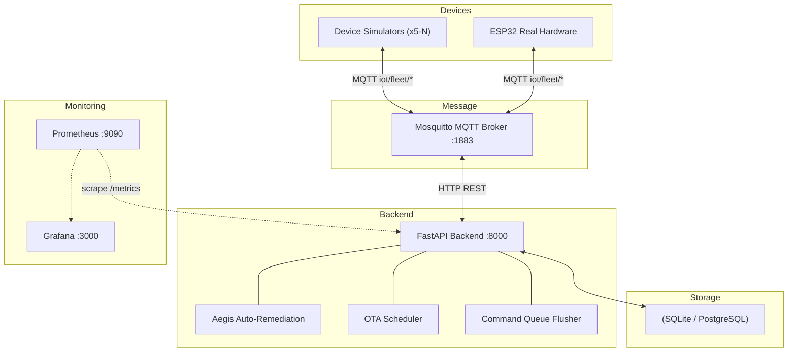
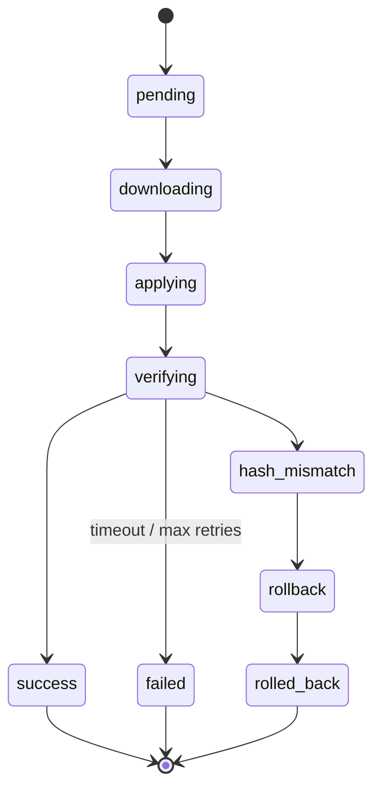

# Fleet Commander — IoT Device Management Module

A production-grade IoT fleet management system built with FastAPI, MQTT, Prometheus, and Grafana. Supports device registration, remote configuration, OTA firmware updates with automatic rollback, V2G arbitrage, predictive maintenance, geofencing, device shadows, and 6 AI agents.

## Architecture



### MQTT Topic Structure

| Topic Pattern | Direction | Purpose |
|---|---|---|
| `iot/fleet/{device_id}/command/ota` | Backend → Device | OTA firmware update command (URL + SHA256 + signature) |
| `iot/fleet/{device_id}/command/config` | Backend → Device | Remote configuration push |
| `iot/fleet/{device_id}/command/v2g` | Backend → Device | V2G charge/discharge command |
| `iot/fleet/{device_id}/command/restart` | Backend → Device | Soft restart command (Aegis) |
| `iot/fleet/{device_id}/command/rollback` | Backend → Device | Firmware rollback command (Aegis) |
| `iot/fleet/{device_id}/command/maintenance` | Backend → Device | Enter/exit maintenance mode |
| `iot/fleet/{device_id}/command/shadow` | Backend → Device | Push desired shadow state |
| `iot/fleet/{device_id}/status/ota` | Device → Backend | OTA lifecycle status updates |
| `iot/fleet/{device_id}/status/v2g` | Device → Backend | V2G status reports (reported shadow) |
| `iot/fleet/{device_id}/heartbeat` | Device → Backend | Periodic heartbeat with telemetry + GPS |
| `iot/fleet/register` | Device → Backend | Auto-registration on first connect |

### OTA State Machine



On `hash_mismatch`: the backend logs the failure, the device simulator auto-reverts to the previous firmware, and the deployment is marked `rolled_back`. Timeout watchers recover on backend restart.

## Quick Start

### Prerequisites

- Docker & Docker Compose v2

### Start the Full Environment

```bash
# Clone and enter the project
cd fleet-management

# Start all services (backend, MQTT, Prometheus, Grafana, simulator)
docker compose --profile demo up --build -d

# Wait for everything to be healthy (about 30 seconds)
docker compose ps
```

This spins up: backend (FastAPI :8000), Mosquitto (:1883), Prometheus (:9090), Grafana (:3000), and a device simulator (5 virtual devices with 20% OTA failure rate). The first 3 devices are EVs with battery simulation.

### Access the Interfaces

| Service | URL | Credentials |
|---|---|---|
| Fleet Dashboard | http://localhost:8181 | Google OAuth or admin/adminadmin |
| API Docs (Swagger) | http://localhost:8181/docs | — |
| Prometheus | http://localhost:9090 | — |
| Grafana | http://localhost:3000 | admin / admin |

## Running Tests

```bash
# Run E2E tests (40 tests) against a clean stack
docker compose down --volumes --remove-orphans
docker compose --profile testing run --build --rm tests

# Run unit tests locally (91 tests)
python -m pytest tests/test_aegis_unit.py tests/test_v2g.py tests/test_simulator_unit.py tests/test_config_unit.py tests/test_session5_unit.py -q
```

## Feature Overview

| # | Feature | Description |
|---|---|---|
| 1 | Telemetry Time-Series | Every heartbeat recorded; trend charts (Chart.js) in device detail modal |
| 2 | Geofencing & Geo-alerts | Circle/polygon geofences with enter/exit alerts on the Leaflet map |
| 3 | Predictive Maintenance Agent | Linear-regression trend analysis predicts failures before they happen |
| 4 | Scheduled OTA / Maintenance Windows | Cron-style OTA scheduling with blackout hours and canary % |
| 5 | Offline Command Queue | Commands buffered for offline devices; delivered on reconnect |
| 6 | Audit Log | Every mutating action recorded with actor, target, details |
| 7 | Device Shadow / Digital Twin | Desired vs reported state (AWS IoT pattern); MQTT sync on reconnect |
| 8 | Firmware Cryptographic Signing | Ed25519 sign/verify on firmware uploads |
| 9 | Device Decommissioning Lifecycle | active → maintenance → decommissioned; QR-claim provisioning |
| 10 | Real Spot-Price Integration | Pluggable spot-price provider for V2G (mock/iex/entsoe/api) |
| 11 | Webhook / Event Stream | Outbound event delivery with HMAC signing and retry tracking |
| 12 | RBAC Roles | user, admin, operator, viewer, fleet_manager |
| 13 | Bulk CSV Import + QR-Claim | Mass device provisioning via CSV; pre-register + claim token flow |

**Plus:** Aegis Auto-Remediation (8 rules, DLQ, dry-run), Alerting Pipeline (dedup, cooldown, escalation, Slack/Email/Webhook), V2G Arbitrage Optimizer, 6 AI Agents (dual-mode: heuristic + CrewAI LLM), Live Fleet Map (Leaflet), Google OAuth + Admin auth, ESP32 sketch.

## API Reference

### Devices

| Method | Endpoint | Description |
|---|---|---|
| `POST` | `/devices/register` | Register a device (auto-registers on first MQTT connect) |
| `POST` | `/devices/{id}/heartbeat` | Update last_seen, telemetry, GPS, battery |
| `POST` | `/devices/{id}/config` | Push remote config via MQTT |
| `GET` | `/devices` | List devices (filter by status, lifecycle; excludes decommissioned by default) |

### OTA

| Method | Endpoint | Description |
|---|---|---|
| `POST` | `/ota/upload` | Upload firmware binary (SHA256 + optional Ed25519 signature) |
| `POST` | `/ota/trigger` | Trigger targeted or bulk OTA update |
| `GET` | `/ota/status` | View OTA deployment statuses |
| `GET` | `/ota/firmware` | List uploaded firmware (includes signature fields) |
| `DELETE` | `/ota/firmware/{id}` | Delete firmware (blocked if deployments exist) |

### Scheduled OTA (Feature 4)

| Method | Endpoint | Description |
|---|---|---|
| `POST` | `/ota/schedules` | Create a scheduled OTA campaign |
| `GET` | `/ota/schedules` | List schedules (filter by status) |
| `POST` | `/ota/schedules/{id}/cancel` | Cancel a scheduled campaign |
| `POST` | `/ota/schedules/{id}/pause` | Pause a scheduled campaign |
| `POST` | `/ota/schedules/{id}/resume` | Resume a paused campaign |

### Telemetry (Feature 1)

| Method | Endpoint | Description |
|---|---|---|
| `GET` | `/telemetry/{device_id}` | Fetch telemetry time-series (filter by hours) |
| `GET` | `/telemetry/{device_id}/latest` | Latest telemetry point |
| `GET` | `/telemetry/{device_id}/stats` | Summary statistics (avg/min/max) |
| `DELETE` | `/telemetry/{device_id}` | Prune old telemetry |

### Geofences (Feature 2)

| Method | Endpoint | Description |
|---|---|---|
| `POST` | `/geofences` | Create a geofence (circle or polygon) |
| `GET` | `/geofences` | List geofences |
| `DELETE` | `/geofences/{id}` | Delete a geofence |
| `PATCH` | `/geofences/{id}/toggle` | Enable/disable a geofence |
| `GET` | `/geofences/{id}/events` | Geofence enter/exit events |
| `GET` | `/geofences/events/all` | All geofence events (filterable) |

### Predictive Maintenance (Feature 3)

| Method | Endpoint | Description |
|---|---|---|
| `POST` | `/predictive/scan` | Run predictive analysis across all online devices |
| `GET` | `/predictive/predictions` | List failure predictions (filter by risk, device) |
| `POST` | `/predictive/predictions/{id}/resolve` | Mark a prediction as resolved |

### Offline Command Queue (Feature 5)

| Method | Endpoint | Description |
|---|---|---|
| `POST` | `/commands/queue` | Queue a command for a device |
| `GET` | `/commands` | List queued commands (filter by device, status) |
| `POST` | `/commands/{id}/retry` | Manually retry delivery |
| `GET` | `/commands/pending/{device_id}` | Pending commands for a device |

### Audit Log (Feature 6)

| Method | Endpoint | Description |
|---|---|---|
| `GET` | `/audit` | List audit logs (filter by actor, action, target) |
| `DELETE` | `/audit/old` | Prune old audit logs |

### Device Shadow (Feature 7)

| Method | Endpoint | Description |
|---|---|---|
| `GET` | `/shadow/{device_id}` | Get desired + reported shadow states |
| `PUT` | `/shadow/{device_id}` | Update desired or reported state |
| `GET` | `/shadow/{device_id}/history` | Shadow state history |

### Device Lifecycle (Feature 9)

| Method | Endpoint | Description |
|---|---|---|
| `POST` | `/lifecycle/{id}/decommission` | Decommission a device |
| `POST` | `/lifecycle/{id}/maintenance` | Enter maintenance mode |
| `POST` | `/lifecycle/{id}/activate` | Return to active |
| `POST` | `/lifecycle/{id}/claim-token` | Generate QR-claim token |
| `POST` | `/lifecycle/claim` | Claim a pre-registered device via token |

### Webhooks & Events (Feature 11)

| Method | Endpoint | Description |
|---|---|---|
| `POST` | `/webhooks` | Create a webhook subscription |
| `GET` | `/webhooks` | List webhooks |
| `DELETE` | `/webhooks/{id}` | Delete a webhook |
| `GET` | `/webhooks/events` | List emitted events |
| `POST` | `/webhooks/test/{id}` | Send a test event |

### Provisioning (Feature 13)

| Method | Endpoint | Description |
|---|---|---|
| `POST` | `/provisioning/bulk-import` | Bulk CSV device import |
| `POST` | `/provisioning/pre-register` | Pre-register device with claim token |

### Alerts

| Method | Endpoint | Description |
|---|---|---|
| `GET` | `/alerts` | List alerts with status/severity filters |
| `GET` | `/alerts/active` | Active + acknowledged alerts |
| `POST` | `/alerts/{id}/acknowledge` | Acknowledge an alert |
| `POST` | `/alerts/{id}/resolve` | Resolve an alert |
| `POST` | `/alerts/{id}/re-notify` | Force re-notification |
| `DELETE` | `/alerts/old` | Prune resolved alerts |

### Aegis Auto-Remediation

| Method | Endpoint | Description |
|---|---|---|
| `GET` | `/aegis/history` | Remediation history (paginated, filterable) |
| `GET` | `/aegis/scan` | Trigger on-demand remediation scan |
| `GET` | `/aegis/summary` | Summary counts for dashboard panel |
| `POST` | `/aegis/ingest` | Webhook receiver for external Alertmanager |
| `POST` | `/aegis/rerun/{id}` | Re-run a specific remediation action |

### Agent Recommendations (6 Agents)

| Method | Endpoint | Description |
|---|---|---|
| `GET` | `/agents/recommendations` | Run all agents (OTA, anomaly, groups) |
| `GET` | `/agents/ota-campaign` | Canary-based rollout plan |
| `GET` | `/agents/anomaly-check` | Fleet health scan |
| `GET` | `/agents/fleet-health` | Fleet health with alert engine triggers |
| `GET` | `/agents/device-groups` | Device groupings by firmware and signal |
| `GET` | `/agents/onboarding` | Device onboarding with conflict detection |
| `GET` | `/agents/v2g-dispatch` | V2G arbitrage schedule (real spot prices) |
| `GET` | `/agents/predictive-scan` | Predictive maintenance analysis |
| `GET` | `/agents/predictive-history` | Failure predictions |
| `GET` | `/agents/aegis/scan` | Aegis auto-remediation via agent |
| `GET` | `/agents/aegis/history` | Aegis remediation history |

**CLI runner:**
```bash
python run_agents.py --ota --firmware 2.0.0
python run_agents.py --anomaly
python run_agents.py --groups
python run_agents.py --v2g --horizon 12
python run_agents.py --onboard "Sensor-042" --onboard-auto
python run_agents.py --predictive
python run_agents.py --predictive-history
python run_agents.py --remediate
python run_agents.py --telemetry <device_id>
python run_agents.py --geofences
python run_agents.py --audit
python run_agents.py --llm          # Use CrewAI LLM agents (requires CREWAI_ENABLED=1)
python run_agents.py --json
```

## Configuration

All configuration is via environment variables (see `.env.example`):

| Variable | Default | Description |
|---|---|---|
| `DATABASE_URL` | `sqlite+aiosqlite:///./data/fleet.db` | Database connection string |
| `MQTT_BROKER_HOST` | `localhost` | MQTT broker hostname |
| `MQTT_BROKER_PORT` | `1883` | MQTT broker port |
| `OTA_TIMEOUT_SECONDS` | `120` | OTA deployment timeout |
| `MAX_RETRY_COUNT` | `3` | Max OTA retry attempts |
| `SIMULATOR_DEVICE_COUNT` | `5` | Virtual devices to simulate |
| `SIMULATOR_HEARTBEAT_INTERVAL` | `10` | Seconds between heartbeats |
| `SIMULATOR_OTA_FAILURE_RATE` | `0.2` | Probability of OTA hash mismatch |
| `SIMULATOR_CITIES` | `Bangalore,Mumbai,Delhi` | Comma-separated city list |
| `TELEMETRY_RETENTION_DAYS` | `30` | Telemetry data retention |
| `GEOFENCE_CHECK_INTERVAL_SECONDS` | `30` | Geofence check interval |
| `OTA_SCHEDULER_INTERVAL_SECONDS` | `30` | Scheduled OTA poll interval |
| `COMMAND_QUEUE_TTL_SECONDS` | `86400` | Queued command TTL |
| `AUDIT_LOG_RETENTION_DAYS` | `90` | Audit log retention |
| `FIRMWARE_SIGNING_PRIVATE_KEY` | — | Ed25519 PEM private key for signing |
| `FIRMWARE_SIGNING_PUBLIC_KEY` | — | Ed25519 PEM public key for verification |
| `FIRMWARE_REQUIRE_SIGNATURE` | `false` | Reject unsigned firmware |
| `SPOT_PRICE_PROVIDER` | `mock` | Spot price provider (mock/iex/entsoe/api) |
| `SPOT_PRICE_URL` | — | Spot price API URL |
| `DEFAULT_USER_ROLE` | `viewer` | Default RBAC role for new OAuth users |
| `AEGIS_SCRAPE_INTERVAL` | `15` | Aegis scrape loop interval (seconds) |
| `AEGIS_DRY_RUN` | `false` | Aegis dry-run mode (log only) |

## Security & Dependency Management

All Python dependencies are pinned to exact versions in `requirements.txt`. Pre-commit hook runs `pip-audit` + `bandit`. See [`SECURITY.md`](SECURITY.md) for the security policy.

- Firmware integrity: SHA256 hash + optional Ed25519 signature
- Auth: Google OAuth + admin basic auth + RBAC roles
- Alert channels: Slack, SMTP email, generic webhook (all optional)

## Scaling for Production

1. **Database**: Switch to PostgreSQL with `--profile production`
2. **MQTT**: Enable TLS + ACLs; cluster for HA
3. **Backend**: Scale horizontally behind a reverse proxy
4. **Firmware Storage**: S3-compatible bucket or NFS volume
5. **Spot Prices**: Configure a real provider for V2G

See [`SCALING.md`](SCALING.md) for details.

## Project Structure

```
fleet-management/
├── app/                      # FastAPI application
│   ├── main.py               # App entry, lifespan, MQTT handlers, schedulers
│   ├── config.py             # Pydantic settings (env-based)
│   ├── database.py           # SQLAlchemy async engine & session
│   ├── models.py             # ORM models (16 tables)
│   ├── schemas.py            # Pydantic request/response schemas
│   ├── mqtt_client.py        # MQTT v5 client wrapper
│   ├── ota_manager.py        # OTA state machine + timeout watcher
│   ├── alert_engine.py       # Alert engine with dedup, cooldown, multi-channel
│   ├── metrics.py            # 30+ Prometheus metrics
│   ├── audit.py              # Audit log helper
│   ├── event_emitter.py      # Webhook event fan-out with HMAC
│   ├── firmware_signing.py   # Ed25519 sign/verify
│   ├── geofence_checker.py   # Geofence math (haversine, point-in-polygon)
│   ├── predictive_maintenance.py  # Telemetry trend analysis
│   ├── spot_prices.py        # Real spot-price integration
│   ├── v2g_optimizer.py      # V2G arbitrage optimizer
│   ├── aegis/                # Aegis Auto-Remediation Engine (8 files)
│   ├── routers/              # API route handlers (14 routers)
│   └── templates/            # Jinja2 templates
│       └── dashboard.html    # Fleet UI dashboard (Chart.js, Leaflet, modals)
├── agents/                   # 6 AI agents (dual-mode: heuristic + CrewAI)
├── simulator/                # Virtual device simulator
├── tests/                    # 91 unit tests + 40 E2E tests
├── run_agents.py             # CLI runner for all agents
├── demo_pitch.sh             # Automated demo pitch script
├── docker-compose.yml        # Multi-service orchestration
├── Dockerfile                # Backend container
├── requirements.txt          # Python dependencies
└── .env.example              # Environment variable templates
```

## Documentation

| Document | Description |
|---|---|
| [DEMO_GUIDE.md](DEMO_GUIDE.md) | Presentation scripts (3 styles) + automated pitch |
| [CUDO.md](CUDO.md) | Customer user documentation (full API + config reference) |
| [architecture.md](architecture.md) | Architecture diagram with 7 animated flows |
| [AGENTS.md](AGENTS.md) | Agent session context + session history |
| [AI_AGENTS.md](AI_AGENTS.md) | Agent architecture deep dive |
| [SECURITY.md](SECURITY.md) | Security hardening guide |
| [SCALING.md](SCALING.md) | Scaling strategy for production |
| [ESP32_GUIDE.md](ESP32_GUIDE.md) | ESP32 Arduino sketch for real hardware |
