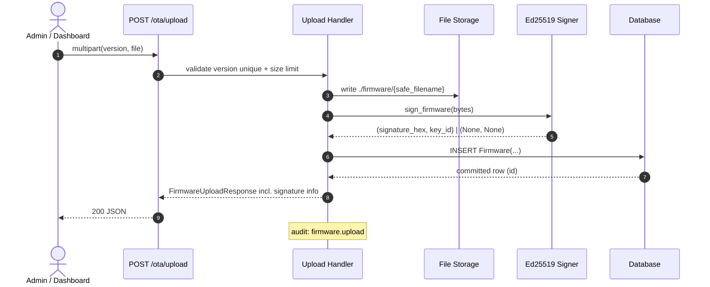
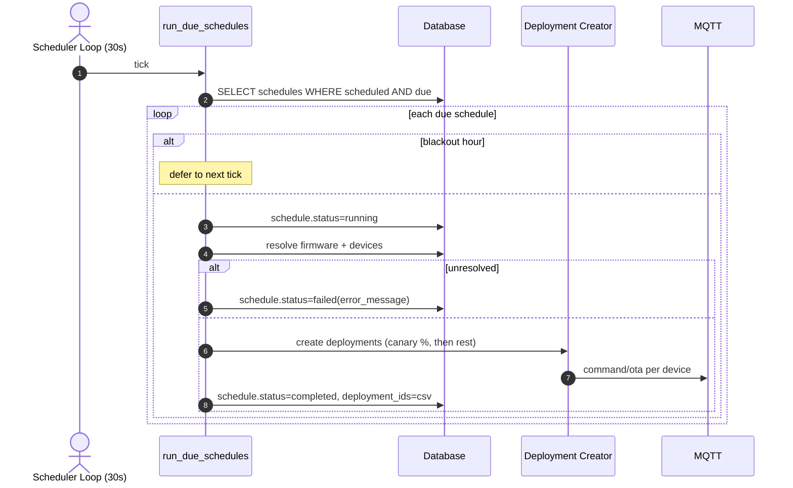
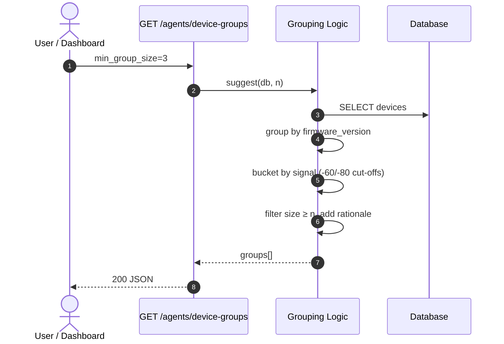
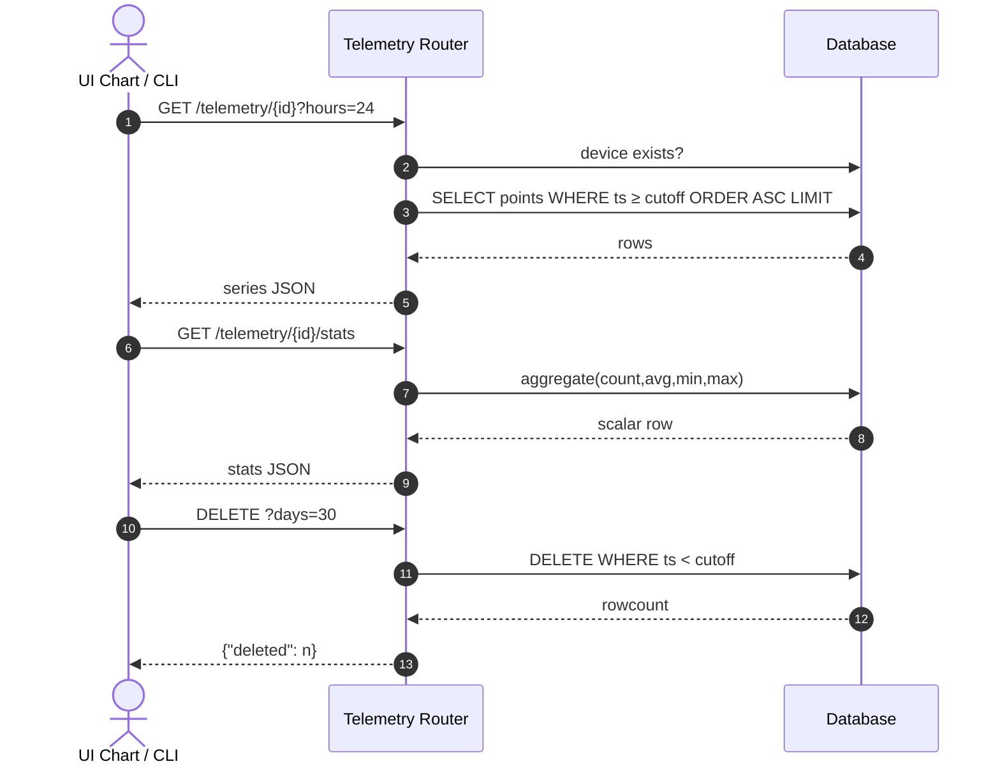
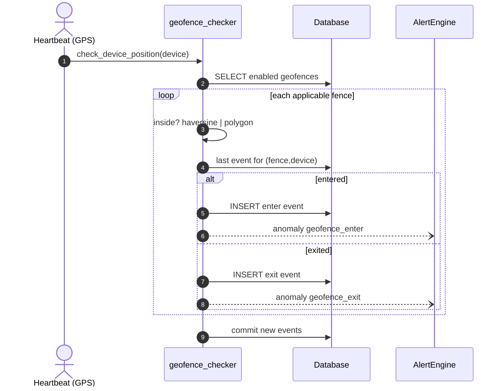
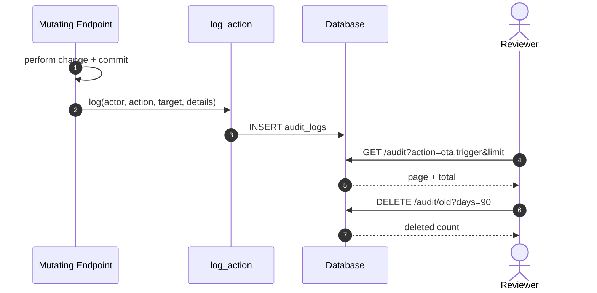
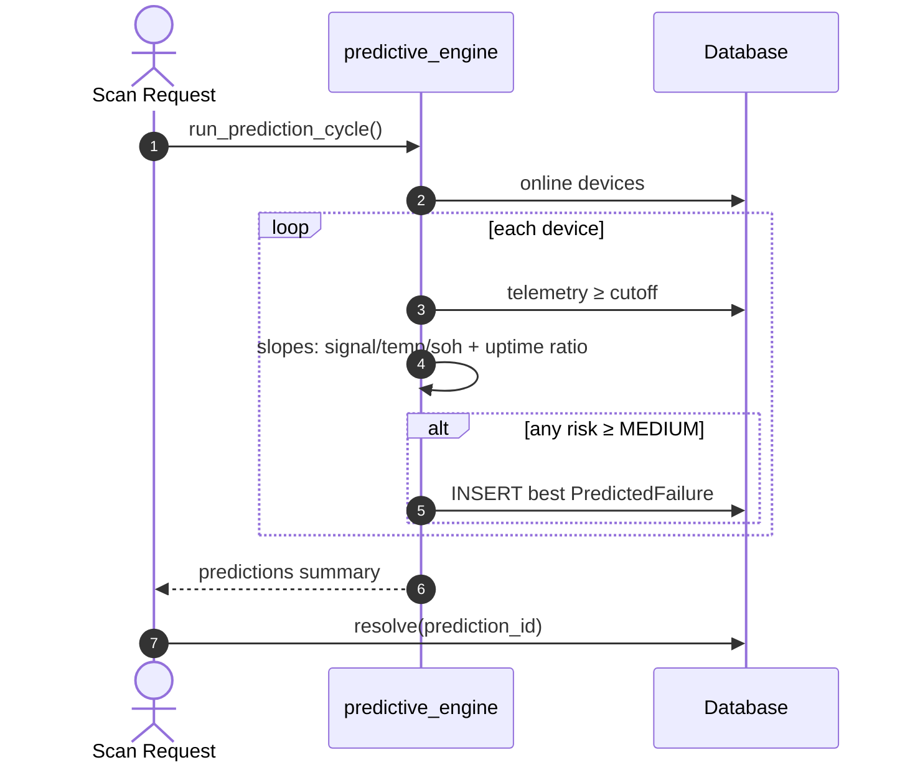
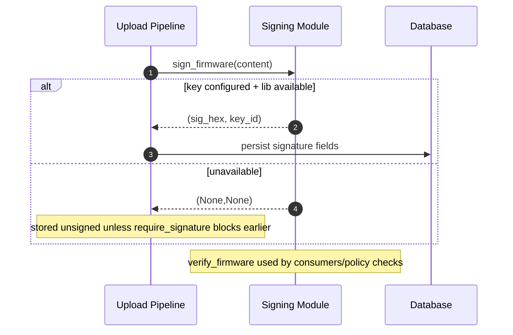
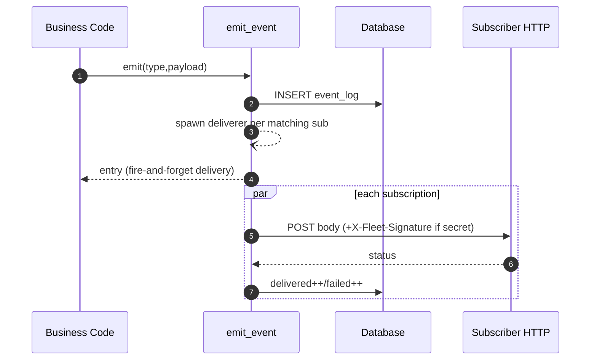

# Fleet Commander — Comprehensive Use Case Document

*Principal Software Architect / Technical Writer analysis of the production-grade IoT fleet management system.*

**Stack:** FastAPI + SQLAlchemy (async) + Mosquitto MQTT + Prometheus + Grafana + Docker Compose
**Scope:** Device registration, remote configuration, OTA firmware updates with rollback, AI agents, alerting, geofencing, predictive maintenance, V2G arbitrage, and more.

**P0 hardening note:** UC-23 … UC-27 (below) add API auth/RBAC, MQTT mTLS + ACLs, certificate lifecycle, multi-tenancy and a hardened production profile — all proven by `scripts/verify-p0.sh` (exit 0).

Each use case below follows a fixed framework:
1. **Overview** — description, actors/trigger, preconditions, postconditions
2. **Technical Execution Flow** — entry points, key components, data flow & dependencies, error handling & edge cases
3. **Sequence & Flow Diagram** — Mermaid.js end-to-end flow

---

### Use Case [UC-01]: Register Devices into the Fleet

#### 1. Overview
* **Description:** Enables new devices to join the fleet either automatically via MQTT on first connection or manually through the REST API. Assigns/updates a unique device record, tracks the MQTT client identifier (e.g., ESP32 MAC), and maintains Prometheus device-count gauges. On reconnect of a previously offline device, queued commands are flushed and desired shadow state is synced.
* **Actors / Trigger:** End user via `POST /devices/register`; MQTT broker via `iot/fleet/register` topic (device auto-registration); Onboarding Agent.
* **Preconditions:** Backend running with DB initialized; for MQTT registration, broker reachable; payload contains `name` (required) plus optional `device_id`, `firmware_version`, `ip_address`, `mqtt_client_id`, `city`.
* **Postconditions:** Device row created or refreshed with `status=online`; `active_devices` and `total_devices` gauges incremented appropriately; audit log entry written; `device.registered` / `device.reconnected` events emitted to webhooks.

#### 2. Technical Execution Flow
* **Entry Point(s):** `app/routers/devices.py:23` (`register_device`, REST); `app/main.py:172` (`handle_mqtt_register`, MQTT handler).
* **Key Components & Services:** SQLAlchemy `Device` model; `app/metrics.py` gauges; `app/audit.py:log_action()`; `app/event_emitter.py:emit_event()`; async tasks `_flush_command_queue()` / `_sync_shadow_to_device()`.
* **Data Flow & Dependencies:** Lookup order by `mqtt_client_id` → `id` → `name`; update-or-insert into SQLite/PostgreSQL; metrics counters incremented in-process; background tasks scheduled on reconnect.
* **Error Handling & Edge Cases:** Duplicate name re-registers existing row (no error); missing optional fields skipped gracefully; Pydantic validation rejects malformed payloads (422); offline→online transition triggers command flush + shadow sync exactly once.

#### 3. Sequence & Flow Diagram

```mermaid
sequenceDiagram
    autonumber
    actor Trigger as Device / End User
    participant Controller as Router / MQTT Handler
    participant Service as Registration Logic
    participant DB as Database
    participant MQ as Webhooks / Metrics

    Trigger->>Controller: register(name, firmware_version, ip, mqtt_client_id)
    Controller->>Service: Validate & resolve identity
    Service->>DB: SELECT by mqtt_client_id → id → name
    DB-->>Service: Existing row or None
    alt Existing device
        Service->>DB: UPDATE status=online, refresh fields
        Service->>MQ: active_devices.inc(); emit device.reconnected
        Service--Service: flush queue + sync shadow tasks
    else New device
        Service->>DB: INSERT Device(status=online)
        Service->>MQ: total_devices.inc(), active_devices.inc()
        Service->>MQ: emit device.registered
    end
    Service-->>Controller: DeviceRegisterResponse
    Controller-->>Trigger: 201 {device_id, name, firmware_version, status}
```

---

### Use Case [UC-02]: Process Device Heartbeats & Telemetry

#### 1. Overview
* **Description:** Ingests periodic heartbeats carrying uptime, signal strength, GPS coordinates, V2G battery fields (SOC/SOH/temp/plug), and resource metrics (CPU/memory/temperature). Updates live device state, persists a time-series telemetry point, and fans out geofence checks, V2G discharge tracking, and reconnect side-effects.
* **Actors / Trigger:** Devices via MQTT topic `iot/fleet/{id}/heartbeat`; REST via `POST /devices/{id}/heartbeat`.
* **Preconditions:** Device registered; MQTT connected; payload includes at least `uptime_percentage` and `signal_strength`.
* **Postconditions:** Device `last_seen/status/signal/soc/soh/battery_temp/plug_status/lat/lng/city` updated; one `Telemetry` row inserted; geofence evaluation task spawned when GPS present; `v2g_active_discharges` gauge adjusted on plug-state transitions.

#### 2. Technical Execution Flow
* **Entry Point(s):** `app/main.py:230` (`handle_mqtt_heartbeat`); `app/main.py:52` (`_record_telemetry`); `app/routers/devices.py:78` (`device_heartbeat`).
* **Key Components & Services:** `Telemetry` model; `geofence_checker.check_device_position()`; `alert_engine.AlertEngine.process_anomalies()`; metrics `telemetry_points_total`, `device_soc`, `v2g_active_discharges`.
* **Data Flow & Dependencies:** MQTT thread → `run_coroutine_threadsafe` onto asyncio loop → single DB session update → fire-and-forget async tasks for telemetry insert and geofence check.
* **Error Handling & Edge Cases:** Unknown device silently ignored; telemetry/geofence failures logged at debug without breaking heartbeat ACK; plug_status transition detection is edge-triggered (inc on start discharge, dec on stop).

#### 3. Sequence & Flow Diagram

```mermaid
sequenceDiagram
    autonumber
    actor Trigger as Device
    participant Controller as MQTT Handler
    participant Service as Heartbeat Logic
    participant DB as Database
    participant GF as Geofence Checker
    participant AL as Alert Engine

    Trigger->>Controller: heartbeat(uptime, signal, soc?, lat?, lng?...)
    Controller->>Service: run_coroutine_threadsafe(handle_mqtt_heartbeat)
    Service->>DB: SELECT Device(id)
    DB-->>Service: Device row
    Service->>DB: UPDATE last_seen/status/fields
    Service--)Service: _record_telemetry(device, payload)
    alt lat & lng present
        Service--)GF: _check_geofences(device_id)
        GF->>DB: Load enabled geofences; compare position
        alt enter/exit transition
            GF->>DB: INSERT GeofenceEvent
            GF--)AL: process_anomalies(geofence alerts)
        end
    end
    Service-->>Controller: done
    Note over Controller: mqtt_messages_received{topic=heartbeat}.inc()
```

---

### Use Case [UC-03]: Upload Firmware Artifact

#### 1. Overview
* **Description:** Administrators upload a firmware binary; the backend computes SHA-256, persists the artifact to disk, records metadata, optionally applies Ed25519 cryptographic signing, and enforces uniqueness/version-size limits.
* **Actors / Trigger:** Admin/dashboard/CLI via `POST /ota/upload` (multipart: `version`, `file`).
* **Preconditions:** Storage directory exists; version string unique; size ≤ `max_upload_size_mb` (100 MB default); signing key configured for signatures (optional).
* **Postconditions:** `Firmware` row persisted (version, filename, sha256_hash, binary_path, file_size, signature?, signing_key_id?, signed_by?); file on disk under `./firmware/`; `firmware_signed_total` incremented when signed; audit entry `firmware.upload`.

#### 2. Technical Execution Flow
* **Entry Point(s):** `app/routers/ota.py:29` (`upload_firmware`); helper `app/firmware_signing.py:sign_firmware()`.
* **Key Components & Services:** FastAPI UploadFile streaming; hashlib SHA-256; `cryptography` Ed25519 signer; `Firmware` model; metrics counter; audit log.
* **Data Flow & Dependencies:** Read bytes → hash → write file → sign (optional) → INSERT row → audit/event fan-out.
* **Error Handling & Edge Cases:** Oversize → 413 (checked both declared size and actual content length); duplicate version → 409; signing library absent → unsigned stored (graceful degradation); path traversal prevented via `os.path.basename`.

#### 3. Sequence & Flow Diagram



---

### Use Case [UC-04]: Trigger OTA Deployment

#### 1. Overview
* **Description:** Pushes a selected firmware to one device, a set of devices, or all online devices. Creates per-device `OtaDeployment` rows, publishes signed OTA commands over MQTT (QoS 1) containing the firmware URL + SHA-256 + deployment id, and arms timeout watchers.
* **Actors / Trigger:** Dashboard/API `POST /ota/trigger`; agent CLI; Scheduled-OTA engine internally reuses this logic.
* **Preconditions:** Firmware exists; MQTT connected (else 503); targets resolvable (online set or explicit ids); request specifies either `device_ids` or `all_devices=true` (else 400).
* **Postconditions:** N deployments created (`pending`→`downloading` on publish success); each device's `current_ota_id` + `previous_firmware_version` stamped; watchers started (`ota_timeout_seconds` default 120 s); metrics `ota_deployments_total{triggered|mqtt_failed}` updated; event `ota.triggered` emitted.

#### 2. Technical Execution Flow
* **Entry Point(s):** `app/routers/ota.py:98` (`trigger_ota`); shared deployment creator `app/routers/scheduled_ota.py:_create_deployment()`.
* **Key Components & Services:** `mqtt_client.publish_ota_command()`; `ota_timeout_watcher.start_watch()`; metrics; audit; webhook emitter.
* **Data Flow & Dependencies:** Resolve firmware → resolve target set → loop: create deployment (flush for id) → stamp device fields → MQTT publish → branch on rc → commit batch.
* **Error Handling & Edge Cases:** Partial MQTT failure tolerated—failures collected in `mqtt_failures[]` and surfaced in response; unknown firmware 404; broker down 503; per-deployment watcher replaces prior watch if re-triggered.

#### 3. Sequence & Flow Diagram

```mermaid
sequenceDiagram
    autonumber
    actor Trigger as User / Scheduler
    participant Controller as POST /ota/trigger
    participant Service as Trigger Logic
    participant DB as Database
    participant MQ as MQTT Broker
    participant W as Timeout Watcher

    Trigger->>Controller: {firmware_id, device_ids|all_devices}
    Controller->>Service: resolve firmware + targets
    Service->>DB: SELECT Firmware / Devices
    loop each target device
        Service->>DB: INSERT OtaDeployment(pending); flush id
        Service->>DB: UPDATE device.current_ota_id, previous_fw
        Service->>MQ: PUBLISH command/ota {url, sha256, deployment_id} QoS1
        alt publish ok
            Service->>DB: deployment.status=downloading
            Service->>W: start_watch(dep_id, mqtt_id)
        else publish fail
            Service->>Service: mqtt_failures.append(device_id)
        end
    end
    Service->>DB: COMMIT
    Service-->>Controller: summary + deployment_ids + failures
    Controller-->>Trigger: 200 JSON (+ ota.triggered webhook)
```

---

### Use Case [UC-05]: Execute OTA State Machine with Auto-Rollback

#### 1. Overview
* **Description:** Tracks each deployment through the lifecycle `pending → downloading → applying → verifying → success` with failure branches to `hash_mismatch → rollback → rolled_back` or terminal `failed`. On success the device's `firmware_version` advances; on verified hash mismatch the backend drives an automatic three-step rollback and restores the prior version.
* **Actors / Trigger:** Device status reports via `iot/fleet/{id}/status/ota`; timeout watcher expiry.
* **Preconditions:** Deployment exists; status transitions respect `STATE_TRANSITIONS` map.
* **Postconditions:** Terminal status persisted; on success device runs new firmware and `current_ota_id` cleared; on rolled_back device restored to `previous_firmware_version`; error messages captured; in-progress gauge adjusted.

#### 2. Technical Execution Flow
* **Entry Point(s):** `app/ota_manager.py:OtaStateMachine.handle_ota_status()` (wired at `app/main.py:397`); `update_deployment_status()`; `OtaTimeoutWatcher.watch_deployment()`.
* **Key Components & Services:** Transition validation table; session-per-operation factory; restart-recovery `_recover_ota_timeout_watches()` (Bug 6 fix) re-arms watches for non-terminal deployments after backend restart.
* **Data Flow & Dependencies:** MQTT callback → mapped enum → guarded UPDATE chain (hash_mismatch auto-cascades rollback→rolled_back) → device-row reconciliation → commit.
* **Error Handling & Edge Cases:** Unknown status string ignored with warning; illegal transition rejected (returns None, no partial writes); retry policy: watcher increments `retry_count` and republishes until `max_retry_count`, then marks failed "Timeout after max retries".

#### 3. Sequence & Flow Diagram

```mermaid
sequenceDiagram
    autonumber
    actor Trigger as Device Report
    participant SM as OtaStateMachine
    participant DB as Database
    participant DEV as Device Row

    Trigger->>SM: status/ota {status, deployment_id, error?}
    alt status == hash_mismatch
        SM->>DB: dep → hash_mismatch(error)
        SM->>DB: dep → rollback
        SM->>DB: dep → rolled_back
        SM->>DEV: fw_version = previous_firmware_version
        SM->>DEV: clear previous_firmware_version + current_ota_id
    else status == failed
        SM->>DB: dep → failed(error)
    else status == success
        SM->>DB: dep → success
        SM->>DEV: fw_version = new; clear current_ota_id
    else progress step (downloading/applying/verifying)
        SM->>DB: dep → step
    end
    Note over SM: invalid transition → warning, no-op
```

---

### Use Case [UC-06]: Schedule OTA Campaigns (Maintenance Windows + Canary)

#### 1. Overview
* **Description:** Lets operators plan future OTA campaigns with blackout hours (deferred execution during business hours) and canary percentage (small first wave). A background loop every `ota_scheduler_interval_seconds` executes due schedules; campaigns support pause/resume/cancel/delete.
* **Actors / Trigger:** REST `POST/GET/DELETE /ota/schedules`, `/cancel`, `/pause`, `/resume`; scheduler loop `main.py:_ota_scheduler_loop()`.
* **Preconditions:** Firmware exists; target resolution yields ≥1 online device at run time (else campaign fails with reason).
* **Postconditions:** Schedule lifecycle `scheduled → running → completed|failed` recorded with timestamps and deployment id list; canary-first ordering preserved; blackout deferral leaves schedule intact for next tick; metrics `ota_scheduled_total{status}` updated; completion webhook emitted.

#### 2. Technical Execution Flow
* **Entry Point(s):** `app/routers/scheduled_ota.py` (CRUD + `run_due_schedules`); `app/main.py:328`.
* **Key Components & Services:** Reuses `_create_deployment()` from UC-04; `settings.ota_firmware_base_url` for URL construction; audit + webhooks.
* **Data Flow & Dependencies:** Query due schedules → per-schedule transactional state changes → canary slice then remainder → aggregate deployment ids back onto schedule row.
* **Error Handling & Edge Cases:** Blackout window check `start ≤ hour < end` skips execution that tick; missing firmware/devices ⇒ `failed` with `error_message`; unexpected exception marks failed but never kills the loop; cancel/pause/resume enforce legal source states (409 otherwise).

#### 3. Sequence & Flow Diagram



---

### Use Case [UC-07]: Monitor Fleet Health & Fire Alerts

#### 1. Overview
* **Description:** Heuristic anomaly scanner evaluates six conditions—weak signal (< −90 dBm online), stuck OTA deployments, OTA failure-rate spike (>30% over ≥5 deployments), mass offline (>30%), per-device offline >5 min, and negative V2G revenue. Findings stream through the Alert Engine which deduplicates, cools down, escalates on repetition, persists, and notifies Slack/Email/Webhook.
* **Actors / Trigger:** `GET /agents/fleet-health` (always notifies), `GET /agents/anomaly-check` (read-only default), CLI `--anomaly/--fleet-health`; geofence checker feeds anomalies too.
* **Preconditions:** Devices/deployments present for meaningful results; channels configured for external delivery (otherwise logged-only).
* **Postconditions:** `Alerts` rows created or count-incremented with dedup_key `type:primary_device`; warning escalates to critical at count ≥ 3; cooldown table suppresses notification storms; metrics `fleet_alerts_total/_active/_notifications_total` maintained.

#### 2. Technical Execution Flow
* **Entry Point(s):** `agents/routers.py:_run_anomaly_agent()`; detectors `agents/async_tools.async_detect_anomalies()`; pipeline `app/alert_engine.AlertEngine.process_anomalies()`.
* **Key Components & Services:** Channel classes SlackChannel/EmailChannel/WebhookChannel (env-driven construction); escalation threshold constant; re-notify endpoint forces channel fan-out for a specific alert.
* **Data Flow & Dependencies:** Pure read queries → anomaly dicts → per-anomaly dedup lookup → create vs increment branch → channel fan-out (requests calls wrapped in try/except).
* **Error Handling & Edge Cases:** Cooldown map keyed by dedup_key prevents duplicate notifications within type-specific windows (120–3600 s); channel send failure isolated per channel; escalation only mutates message prefix once.

#### 3. Sequence & Flow Diagram

```mermaid
sequenceDiagram
    autonumber
    actor Trigger as Caller (API/CLI/Dashboard)
    participant C as agents router
    participant AD as anomaly detector
    participant AE as AlertEngine
    participant DB as Database
    participant CH as Slack/Email/Webhook

    Trigger->>C: GET /agents/fleet-health
    C->>AD: async_detect_anomalies(db)
    AD-->>C: anomalies[]
    C->>AE: process_anomalies(anomalies)
    loop each anomaly
        AE->>AE: dedup_key = type:device; cooldown?
        alt cooling down
            Note over AE: skip
        else existing active alert
            AE->>DB: count+=1; escalate at ≥3
            opt count % 3 == 0
                AE--)CH: notify
            end
        else new
            AE->>DB: INSERT Alert(active)
            AE--)CH: notify all configured channels
        end
    end
    C-->>Trigger: report {critical, warnings, processed}
```

---

### Use Case [UC-08]: Suggest Device Groups

#### 1. Overview
* **Description:** Groups the fleet along two actionable dimensions—firmware-version cohorts (OTA batching) and signal-quality buckets good/moderate/poor (regional coverage diagnosis)—filtering out groups smaller than `min_group_size` and attaching human-readable rationale.
* **Actors / Trigger:** `GET /agents/device-groups?min_group_size=N`; CLI `--groups`; dashboard panel.
* **Preconditions:** ≥1 registered device; meaningful output needs ≥ min_group_size members per bucket.
* **Postconditions:** Structured groups list (name, dimension, value, device_ids, count, rationale) returned; no persistence (pure computation).

#### 2. Technical Execution Flow
* **Entry Point(s):** `agents/routers.get_device_groups()` → `async_suggest_device_groups()` (`agents/async_tools.py:140`).
* **Key Components & Services:** Reuses canonical device serialization (incl. mqtt_client_id fix from Session 3).
* **Data Flow & Dependencies:** Single devices query → two in-memory grouping passes → threshold filter.
* **Error Handling & Edge Cases:** Empty fleet returns explanatory message; devices lacking signal default to 0 (poor bucket); O(n) complexity safe for large fleets.

#### 3. Sequence & Flow Diagram



---

### Use Case [UC-09]: Optimize V2G Arbitrage Dispatch

#### 1. Overview
* **Description:** For each plugged-in EV, generates an hourly charge/discharge/idle schedule maximizing net revenue (energy arbitrage minus modeled battery degradation), enforcing SOC bounds, departure-time SOC target, SOH floor (no discharge <70%), and Arrhenius temperature penalty. Dispatch commands are published over MQTT; aggregates feed Grafana panels.
* **Actors / Trigger:** `GET /agents/v2g-dispatch?horizon_hours=&device_ids=`; CLI `--v2g`.
* **Preconditions:** Devices expose soc/soh/battery_temp/plug_status via heartbeats; spot-price provider configured or mock fallback accepted.
* **Postconditions:** Response carries per-slot economics and totals; gauges `v2g_projected_revenue_dollars` / `battery_degradation_cost_dollars` set; non-idle slots published as `command/v2g` messages.

#### 2. Technical Execution Flow
* **Entry Point(s):** `agents/routers.get_v2g_dispatch()`; optimizer `app/v2g_optimizer.heuristic_optimize()`; pricing `app/spot_prices.fetch_spot_prices()`.
* **Key Components & Services:** Degradation model `degradation_cost_per_kwh(DegradationParams)`; mock diurnal price generator; provider fetch with unit normalization (MWh→kWh) and mock padding.
* **Data Flow & Dependencies:** Device snapshot query → price vector (24 h) → per-device greedy heuristic respecting constraints → aggregate + publish loop.
* **Error Handling & Edge Cases:** Disconnected vehicles short-circuit to empty schedule; provider failure falls back to mock with exception log; SOC clamping prevents bound violations; infinite degradation cost blocks discharge entirely.

#### 3. Sequence & Flow Diagram

```mermaid
sequenceDiagram
    autonumber
    actor Trigger as User / CLI
    participant C as GET /agents/v2g-dispatch
    participant SP as Spot Price Provider
    participant OPT as Heuristic Optimizer
    participant DB as Database
    participant MQ as MQTT

    Trigger->>C: horizon_hours=24
    C->>DB: device snapshots (soc,soh,temp,plug)
    C->>SP: fetch_spot_prices(24)
    SP-->>C: prices[kWh] (mock fallback ok)
    loop each EV device
        C->>OPT: optimize(soc, soh, temp, plug, prices)
        OPT-->>C: slots[], revenue, deg_cost
    end
    C--)MQ: publish command/v2g per non-idle slot
    C-->>Trigger: schedule + totals JSON
```

---

### Use Case [UC-10]: Query Telemetry Time-Series

#### 1. Overview
* **Description:** Provides historical telemetry access for trend charts and analytics: ranged series fetch, latest-point lookup, SQL-aggregate statistics, and retention pruning. Indexed on (device_id, timestamp) for efficient window scans up to 168 h.
* **Actors / Trigger:** `GET /telemetry/{id}`, `/latest`, `/stats`; `DELETE /telemetry/{id}?days=`; CLI `--telemetry`.
* **Preconditions:** Telemetry rows exist (populated by heartbeat pipeline UC-02); device must exist for series endpoints.
* **Postconditions:** Points ordered ascending with limit cap; stats return sample count plus avg/min/max across key gauges; prune deletes rows older than cutoff and reports rowcount.

#### 2. Technical Execution Flow
* **Entry Point(s):** `app/routers/telemetry.py` all four routes.
* **Key Components & Services:** SQLAlchemy `func.count/avg/min/max` aggregation; retention default `settings.telemetry_retention_days` (30).
* **Data Flow & Dependencies:** Read-only selects against indexed table; delete uses bulk DELETE ... WHERE.
* **Error Handling & Edge Cases:** 404 on unknown device / empty latest; Query parameter bounds enforced (hours 1–168, limit ≤5000).

#### 3. Sequence & Flow Diagram



---

### Use Case [UC-11]: Manage Geofences & Geo-Alerts

#### 1. Overview
* **Description:** CRUD for circular (haversine radius) and polygon (ray-casting) zones with per-device targeting or fleet-wide scope. Every GPS-bearing heartbeat evaluates enabled fences, persisting enter/exit transitions (edge-detected against last event) and converting them into alert-engine anomalies.
* **Actors / Trigger:** REST `/geofences` CRUD + toggle; automatic evaluation inside heartbeat path; dashboard map overlays.
* **Preconditions:** Circle requires center+radius; polygon requires coordinate array; devices need lat/lng from heartbeats.
* **Postconditions:** Geofence rows managed; `GeofenceEvent` history queryable per fence/device/type; alerts fired per `alert_on_enter/exit` flags; metric `geofence_events_total{enter|exit}`.

#### 2. Technical Execution Flow
* **Entry Point(s):** `app/routers/geofences.py`; geometry `app/geofence_checker.py` (`is_inside`, `check_device_position`, `build_geofence_alerts`); wiring `app/main.py:_check_geofences`.
* **Key Components & Services:** Haversine formula; point-in-polygon ray casting with malformed-JSON guard; alert engine integration.
* **Data Flow & Dependencies:** Per-fence last-event lookup determines previous containment; only true transitions write rows; events fan out to anomaly processing within same session.
* **Error Handling & Edge Cases:** Disabled fences skipped; device not matching fence's id list skipped; corrupt polygon coords treated as outside; duplicate suppression inherent via last-event comparison.

#### 3. Sequence & Flow Diagram



---

### Use Case [UC-12]: Manage Device Lifecycle (Maintenance / Decommission / QR-Claim)

#### 1. Overview
* **Description:** Governs the operational state machine `active ↔ maintenance → decommissioned` with actor/reason attribution, optional factory-reset command on decommission, and QR-style claim tokens bridging pre-registration to physical bring-up.
* **Actors / Trigger:** REST `/lifecycle/{id}/decommission|/maintenance|/activate|/claim-token`; `/lifecycle/claim` consumed by the physical device.
* **Preconditions:** Target exists; decommission blocked if already decommissioned (409); claim requires valid unclaimed token.
* **Postconditions:** Lifecycle field + attribution timestamps updated; MQTT maintenance enter/exit published; transitions counter labeled from→to; audit + webhooks per action; claim atomically renames/activates device and burns token.

#### 2. Technical Execution Flow
* **Entry Point(s):** `app/routers/lifecycle.py` five routes.
* **Key Components & Services:** `mqtt_client.publish_maintenance_command()`; `secrets.token_urlsafe(16)`; metrics `device_lifecycle_transitions`.
* **Data Flow & Dependencies:** Straightforward guarded updates; claim performs lookup-by-token then multi-field overwrite in one commit.
* **Error Handling & Edge Cases:** Double decommission 409; invalid/expired token 404; maintenance skip-heartbeat behavior honored by simulator; activate clears decommission metadata.

#### 3. Sequence & Flow Diagram

```mermaid
sequenceDiagram
    autonumber
    actor Trigger as Operator / Physical Device
    participant LC as Lifecycle Router
    participant DB as Database
    participant MQ as MQTT

    alt decommission
        Trigger->>LC: POST /{id}/decommission(reason, factory_reset?)
        LC->>DB: guard not already decommissioned
        LC->>DB: set decommissioned_* + status=offline
        opt factory_reset
            LC--)MQ: maintenance enter (factory reset hint)
        end
    else maintenance / activate
        Trigger->>LC: POST /{id}/maintenance | /activate
        LC->>DB: lifecycle_status = maintenance|active
        LC--)MQ: maintenance enter/exit command
    else claim
        Trigger->>LC: POST /claim {claim_token, name,...}
        LC->>DB: find by token (404 if none)
        LC->>DB: apply identity fields; burn token; activate
    end
    LC-->>Trigger: result JSON (audit+webhook emitted)
```

---

### Use Case [UC-13]: Queue Commands for Offline Devices

#### 1. Overview
* **Description:** Durable store-and-forward layer: commands (ota/config/v2g/restart/rollback) submitted while a device is unreachable are persisted with TTL and retry budget, then delivered opportunistically—immediately if the device is hot, on next heartbeat reconnect, or via the periodic flusher loop sweeping all online devices.
* **Actors / Trigger:** REST `POST /commands/queue`, list/get/retry/cancel, `GET /commands/pending/{id}`; hooks in register/heartbeat handlers; background flusher every 15 s.
* **Preconditions:** Device exists; TTL positive; payload JSON-serializable.
* **Postconditions:** Command reaches `delivered` (timestamped) or exhausts retries → `failed`; stale entries expire with dedicated metric; queue-depth gauge tracks backlog.
* 
#### 2. Technical Execution Flow
* **Entry Point(s):** `app/routers/command_queue.py`; `app/main.py:_flush_command_queue(_for_device)` + `_command_queue_flusher_loop`.
* **Key Components & Services:** `mqtt_client.publish_raw()` generic publisher; expiry/retry accounting; audit logging on enqueue.
* **Data Flow & Dependencies:** Enqueue checks recency (<60 s since last_seen) for inline delivery attempt; flush iterates oldest-first, skipping expired; manual retry bypasses waiting.
* **Error Handling & Edge Cases:** Publish failure increments retry_count up to max_retries=3 then failed; expiry checked before send; duplicate submissions allowed (caller's responsibility).

#### 3. Sequence & Flow Diagram

```mermaid
sequenceDiagram
    autonumber
    actor Trigger as Operator / Automation
    participant CQ as Command Queue
    participant DB as Database
    participant MQ as MQTT

    Trigger->>CQ: POST /commands/queue {type,payload,ttl}
    CQ->>DB: device exists? INSERT queued(expires_at)
    alt device hot (seen <60s)
        CQ->>MQ: publish_raw(command topic)
        MQ-->>CQ: rc
        CQ->>DB: mark delivered(+ts)
    end
    Note over CQ: later — reconnect hook OR 15s flusher
    CQ->>DB: SELECT queued oldest-first
    loop each cmd
        alt expired
            CQ->>DB: status=expired
        else publish ok
            CQ->>DB: status=delivered
        else publish fail
            CQ->>DB: retry_count++; maybe failed
        end
    end
```

---

### Use Case [UC-14]: Record & Query Audit Trail

#### 1. Overview
* **Description:** Every mutating surface (devices, OTA, geofences, lifecycle, provisioning, shadow, webhooks, commands) appends structured audit rows capturing actor, action verb, target type/id, JSON details, IP (when available), and timestamp. Read API supports filtered pagination; pruning removes old resolved-alert noise via the companion endpoint.
* **Actors / Trigger:** Implicitly invoked post-commit inside routers; queried via `GET /audit`; pruned via `DELETE /audit/old`.
* **Preconditions:** AuditLog table migrated; caller passes an actor identifier ("dashboard", user email, "system").
* **Postconditions:** Append-only trail suitable for compliance review; filters combinable (actor/action/target_type/target_id) AND-wise.

#### 2. Technical Execution Flow
* **Entry Point(s):** `app/audit.py:log_action/get_audit_logs/prune_old_logs`; router `app/routers/audit.py`.
* **Key Components & Services:** Single helper keeps call-sites one-liners; count query mirrors filter set for accurate totals.
* **Data Flow & Dependencies:** Insert piggybacks on the same transaction/session as business change where feasible.
* **Error Handling & Edge Cases:** Audit failures must never mask business success (helpers swallow/log); large detail JSONs discouraged; retention default 90 days.

#### 3. Sequence & Flow Diagram



---

### Use Case [UC-15]: Synchronize Device Shadow (Digital Twin)

#### 1. Overview
* **Description:** AWS-IoT-style desired vs reported documents with monotonic versions per state, delta visibility (`in_sync` flag comparing latest payloads), push-on-update for desired, replay of pending desired on device reconnect, and reported capture from V2G status messages.
* **Actors / Trigger:** REST `PUT/GET /shadow/{id}` + history; internal `_sync_shadow_to_device` on reconnect; simulator replies to shadow command with reported snapshot.
* **Preconditions:** Device exists; payload dict JSON-serializable; MQTT up for immediate push (persistence still guaranteed).
* **Postconditions:** New versioned shadow row per update; desired pushes to `command/shadow`; reported rows auto-created from `status/v2g` handler; metric `shadow_updates_total{state}`.

#### 2. Technical Execution Flow
* **Entry Point(s):** `app/routers/shadow.py`; `app/main.py:_sync_shadow_to_device`; `handle_mqtt_v2g_status` reported writer.
* **Key Components & Services:** Version = count+1 within state partition; equality-based sync check.
* **Data Flow & Dependencies:** Update path commits before publish so offline devices still converge on reconnect replay.
* **Error Handling & Edge Cases:** No desired yet ⇒ in_sync true vacuously; MQTT down degrades to persistence-only; history capped (limit param).

#### 3. Sequence & Flow Diagram

```mermaid
sequenceDiagram
    autonumber
    actor Trigger as Operator
    participant SR as Shadow Router
    participant DB as Database
    participant MQ as MQTT

    Trigger->>SR: PUT /shadow/{id} desired {...}
    SR->>DB: version=count(desired)+1; INSERT
    SR--)MQ: publish command/shadow (if connected)
    Trigger->>SR: GET /shadow/{id}
    SR->>DB: latest desired + latest reported
    SR-->>Trigger: {desired, reported, in_sync}
    Note over SR: reconnect → replay latest desired
```

---

### Use Case [UC-16]: Predict Failures from Telemetry Trends

#### 1. Overview
* **Description:** Least-squares slope analysis over 24 h telemetry windows flags four risk archetypes—signal_degradation, thermal, battery_degradation, intermittent connectivity—scoring risk 0–1 with confidence scaled by sample depth, estimating hours-to-threshold, storing the highest-risk finding per device, and surfacing high/medium buckets to the dashboard.
* **Actors / Trigger:** `POST /predictive/scan`, `GET /predictive/predictions`, resolve endpoint; agent wrappers; invoked ad hoc or from demo flows.
* **Preconditions:** ≥5 samples in window per analyzed signal; only online devices scanned.
* **Postconditions:** `PredictedFailure` rows with evidence JSON + recommendation; counters `predicted_failures_total{risk_type}` and active gauge; resolve flips flag and decrements gauge.

#### 2. Technical Execution Flow
* **Entry Point(s):** `app/predictive_maintenance.analyze_device/run_prediction_cycle/get_predictions`; router `app/routers/predictive.py`.
* **Key Components & Services:** Threshold constants HIGH=0.7/MEDIUM=0.4; per-type slope gates (e.g., signal < −0.5/step, temp > 0.3 or >70 °C, SOH < −0.05 or <75%).
* **Data Flow & Dependencies:** One telemetry select per device; best-of selection collapses multiple simultaneous risks into single row (keeps signal-to-noise manageable).
* **Error Handling & Edge Cases:** Insufficient data silently skips; division guards in slope math; intermittent rule uses ratio-of-low-uptime rather than slope.

#### 3. Sequence & Flow Diagram



---

### Use Case [UC-17]: Sign Firmware Cryptographically (Ed25519)

#### 1. Overview
* **Description:** Optional supply-chain integrity: uploads auto-sign when a PEM private key is configured, storing signature hex + short key id; verification helper enforces policy (`firmware_require_signature`) including fail-closed semantics when keys/library are absent but enforcement demanded.
* **Actors / Trigger:** Upload pipeline (UC-03) invokes transparently; operators manage keys via env config; `generate_keypair()` aids setup.
* **Preconditions:** `cryptography` installed for real operations; keys valid Ed25519 PEMs.
* * *Postconditions:* Signed artifacts carry verifiable provenance; unsigned uploads rejected when policy demands; key rotation supported by keeping old public key for legacy verification.
*
#### 2. Technical Execution Flow
* **Entry Point(s):** `app/firmware_signing.py` trio `sign_firmware/verify_firmware/generate_keypair`; consumption in `ota.upload`.
* **Key Components & Services:** Raw-key public bytes prefix (8 B hex) as key_id; import-guard degrades gracefully when lib missing.
* **Data Flow & Dependencies:** Pure in-memory crypto; no extra I/O beyond config reads.
* **Error Handling & Edge Cases:** Non-Ed25519 key rejected with warning; verify treats missing signature per strictness flag; tamper detection via verify False.

#### 3. Sequence & Flow Diagram



---

### Use Case [UC-18]: Integrate Real Spot Prices

#### 1. Overview
* **Description:** Pluggable day-ahead price ingestion replacing synthetic curves: generic authenticated API returning flat arrays or `{unit, prices[]}` objects, automatic MWh→kWh normalization, shortfall padding from the mock generator, and hard fallback on any transport/parse failure so optimization never starves.
* **Actors / Trigger:** V2G dispatch path (UC-09) each call; configuration via env (`spot_price_provider/url/api_key`).
* **Preconditions:** Provider ≠ mock implies URL set; network egress permitted.
* **Postconditions:** Exactly `hours`-length USD/kWh vector regardless of upstream shape; failures observable via exception logs.
* 
#### 2. Technical Execution Flow
* **Entry Point(s):** `app/spot_prices.fetch_spot_prices/_fetch_from_api`; mock source reused from optimizer module.
* **Key Components & Services:** Bearer-token header injection; per-item float coercion tolerating dicts or scalars.
* **Data Flow & Dependencies:** Synchronous requests with 10 s timeout executed inline (acceptable latency for hourly planning).
* **Error Handling & Edge Cases:** raise_for_status funnels HTTP errors to blanket except → mock; unit case-insensitive; fewer-than-requested items padded seamlessly.

#### 3. Sequence & Flow Diagram

```mermaid
sequenceDiagram
    autonumber
    participant OPT as V2G Dispatcher
    participant SP as spot_prices
    participant EXT as Provider API

    OPT->>SP: fetch(hours=24)
    alt provider==mock or url empty
        SP-->>OPT: mock diurnal curve
    else try API
        SP->>EXT: GET url (Bearer?)
        alt success
            SP->>SP: normalize units, pad shortfall
            SP-->>OPT: prices[]
        else any failure
            Note over SP: log exception
            SP-->>OPT: mock curve
        end
    end
```

---

### Use Case [UC-19]: Stream Events to Webhook Subscribers

#### 1. Overview
* **Description:** Domain events (registrations, OTA milestones, lifecycle changes, geofence hits, bulk imports...) are journaled in `event_log` and fanned out asynchronously to enabled subscriptions whose type filter matches (`*` or CSV). Deliveries are HMAC-SHA256 signed when a secret is set; per-event delivered/failed tallies provide delivery observability.
* **Actors / Trigger:** Any service code calling `emit_event()`; subscriber management REST `/webhooks`; test-fire endpoint.
* **Preconditions:** Subscription URL reachable within 10 s; secret shared out-of-band for verification.
* **Postconditions:** Event row immutable with counts updated post-delivery attempts; subscribers receive envelope `{event_id, event_type, payload, timestamp}` + signature header.

#### 2. Technical Execution Flow
* * **Entry Point(s):*** `app/event_emitter.emit_event/_deliver_webhook/get_events`; router `app/routers/webhooks.py`.
* **Key Components & Services:** asyncio.create_task per matching sub (non-blocking emission); requests executed via `asyncio.to_thread`; metric `webhook_deliveries_total{result}`.
* **Data Flow & Dependencies:** Fresh session opened inside delivery task to bump counters (avoids parent-session lifetime coupling).
* **Error Handling & Edge Cases:** Non-2xx counted failed, never retried automatically; disabled subs filtered upfront; malformed URLs fail fast per attempt.

#### 3. Sequence & Flow Diagram



---

### Use Case [UC-20]: Bulk Provision Devices (CSV Import + Pre-registration)

#### 1. Overview
* **Description:** Fleet-scale onboarding: UTF-8-BOM-tolerant CSV ingest creating offline devices each with a fresh QR claim token, per-row error accumulation instead of abort-on-first-failure, plus a single-device pre-register variant. Counters and audit/webhook signals reflect net-new additions.
* **Actors / Trigger:** REST `POST /provisioning/bulk-import` (multipart CSV), `POST /provisioning/pre-register?name=...`.
* **Preconditions:** Header row required; name column mandatory per row; duplicates (existing names) skipped with reasons.
* **Postconditions:** Imported devices await physical claim via UC-12; response enumerates imported ids + skipped diagnostics; `total_devices` grows by successes only.

#### 2. Technical Execution Flow
* **Entry Point(s):** `app/routers/provisioning.py` both routes.
* **Key Components & Services:** csv.DictReader streaming; secrets token generation; single flush-then-commit batching for import efficiency.
* **Data Flow & Dependencies:** Duplicate check per row (SELECT by name) trades throughput for safety at competition scale.
* **Error Handling & Edge Cases:** Non-.csv rejected 400; missing name/dupes appended to errors[]; empty optional columns coerced to None; token collision practically impossible (128-bit).

#### 3. Sequence & Flow Diagram

```mermaid
sequenceDiagram
    autonumber
    actor OP as Operator
    participant PR as provisioning router
    participant DB as Database

    OP->>PR: upload inventory.csv
    PR->>PR: decode(utf-8-sig) DictReader
    loop rows
        alt name missing / duplicate
            PR->>PR: errors.append(row reason); skipped++
        else ok
            PR->>DB: INSERT offline device + claim_token
            PR->>PR: imported++
        end
    end
    PR->>DB: COMMIT
    PR-->>OP: {imported, skipped, errors[], device_ids[]}
```

---

### Use Case [UC-21]: Onboard a Device with AI Assistance

#### 1. Overview
* **Description:** Conversational-style guided introduction: validates candidate identity against existing names/MQTT client-ids, recommends firmware (requested version matched, else newest), proposes starter config, then—on approval or `auto_register=true`—creates the device, pushes config over MQTT, and verifies liveness via subsequent device listing.
* **Actors / Trigger:** `GET /agents/onboarding` params; CLI flags `--onboard*`; dashboard modal.
* **Preconditions:** Name supplied (hard requirement); conflict-free required for registration path.
* **Postconditions:** Plan-mode output marked `human_input_required`; execute-mode output includes created device snapshot, `registration_status=created`, `mqtt_config_pushed`, `verification_status∈{verified,pending}`; conflicts block with structured diagnostics.

#### 2. Technical Execution Flow
* **Entry Point(s):** Router wrapper `_run_onboarding_agent` → tool `async_onboard_device` (`agents/async_tools.py:413`) with HTTP twin in `agents/tools.py` for CLI mode (dual-execution architecture).
* **Key Components & Services:** Case-insensitive name comparison; mqtt_client_id uniqueness scan (enabled by Session 3 serialization fix); remote-config publish reuse.
* **Data Flow & Dependencies:** Three reads (devices, firmware, post-register devices) + conditional insert; no transactions spanning MQTT I/O.
* **Error Handling & Edge Cases:** Missing name short-circuits error dict; firmware miss falls back to newest rather than failing; MQTT outage degrades push flag but registration stands; verification limited to immediate-listing heuristic.

#### 3. Sequence & Flow Diagram

```mermaid
sequenceDiagram
    autonumber
    actor U as Operator
    participant AG as Onboarding Agent
    participant DB as Database
    participant MQ as MQTT

    U->>AG: onboard(name, fw?, auto?)
    AG->>DB: list devices → conflict scan (name, mqtt_id)
    AG->>DB: list firmware → pick recommended
    alt conflicts
        AG-->>U: plan(conflicts[]) halt
    else plan requested
        AG-->>U: plan(config, fw) human_input_required
    else auto_register
        AG->>DB: INSERT device online
        AG--)MQ: publish initial config
        AG->>DB: re-list → verify presence+online
        AG-->>U: created + verification_status
    end
```

---

### Use Case [UC-22): Self-Heal Fleet via Aegis Auto-Remediation

#### 1. Overview
* **Description:** Closed-loop controller scraping own `/metrics` every 15 s: parses gauges/histogram families (`fleet_active_devices`, `fleet_ota_in_progress`, latency histograms), classifies threshold breaches into severity-tagged `RemediationSignal`s, matches registry rules (R001–R008: throttle OTA, QoS downgrade, soft restart, heartbeat scale-up, batch rollback, migration, artifact cleanup, human escalation), executes with timeout+retry+DLQ semantics, journals full input/output snapshots, and escalates unmatched signals through the alert engine.
* **Actors / Trigger:** Lifespan-spawned scheduler task; on-demand `GET /aegis/scan` + `/aegis/ingest` webhook; rerun endpoint; dry-run global switch.
* **Preconditions:** Metrics endpoint reachable (`aegis_backend_url`); registry loaded (DB overrides merged at startup — Bug 5 fix).
* **Postconditions:** `remediations` rows carry lifecycle status ∈ {in_progress, success, failed, dry_run, dlq, escalated}; seven `aegis_*` metric families expose loop health; unmatched criticals reach humans via UC-07 plumbing.

#### 2. Technical Execution Flow
* **Entry Point(s):** `app/aegis/engine.AegisEngine.run_cycle/_classify_metrics/_execute_remediation/_escalate_human/process_ingest`; actions registry `app/aegis/actions.py`; scheduler `app/aegis/scheduler.py`; agent façade `agents/routers._run_remediation_agent`.
* **Key Components & Services:** Histogram mean-from-sum/count extraction restricted to latency-named families; per-action timeout via `asyncio.wait_for`; DLQ depth gauge on terminal action failure; rule-config persistence round-trip.
* **Data Flow & Dependencies:** Scrape → text parse (no Prometheus query API dependency) → pure classification → transactional remediation journal → side-effectful action execution outside initial insert transaction.
* **Error Handling & Edge Cases:** Empty scrape aborts cycle early (warning); dry-run logs decisions without side effects; action timeout produces synthetic failed Result; sequential per-signal execution isolates failures; rerun reconstructs signal from stored snapshot for replay.

#### 3. Sequence & Flow Diagram

```mermaid
sequenceDiagram
    autonumber
    participant SCH as AegisScheduler 15s
    participant ENG as AegisEngine
    participant MET as /metrics scrape
    participant REG as Rule Registry R001-R008
    participant ACT as Action Executor
    participant DB as Database
    participant AL as Alert Engine

    SCH->>ENG: run_cycle(db)
    ENG->>MET: GET metrics text
    MET-->>ENG: prom text
    ENG->>ENG: classify → signals[]
    loop each signal
        ENG->>REG: match(signal)
        alt rule found
            ENG->>DB: journal in_progress
            ENG->>ACT: exec w/ timeout,retry,dry-run?
            ACT-->>ENG: result(ok|fail|dlq)
            ENG->>DB: finalize(status,snapshots,duration)
        else no rule
            ENG->>AL: escalate(critical anomaly)
            ENG->>DB: journal escalated
        end
    end
```


---

### Use Case [UC-23]: Enforce REST Authentication, RBAC & Audited Automation

#### 1. Overview
* **Description:** Closes the wide-open REST surface. Every tenant read/mutation requires an authenticated principal; role rank (`viewer<user<operator<fleet_manager<admin`) gates each operation class; automation uses SHA-256-hashed API keys; firmware downloads are gated by short-lived HMAC tokens; audit rows carry real actor identities.
* **Actors / Trigger:** Any HTTP client. Dependencies resolve principals from Google/admin JWT cookies, `Authorization: Bearer`, or `X-API-Key`; `AUTH_MODE=open` short-circuits for the legacy demo.
* **Preconditions:** `AUTH_MODE=strict` refuses default `JWT_SECRET_KEY`/admin password at startup; docs disabled via `DOCS_ENABLED=false` in production compose.
* **Postconditions:** Unauthenticated writes → 401; insufficient rank → 403; cross-scope → 404; audit `actor` ∈ {oauth email, `admin:<user>`, `apikey:<name>`, `system`} — never `"dashboard"`.

#### 2. Technical Execution Flow
* **Entry Point(s):** `app/deps.py` (`require_user/require_role/require_admin/resolve_principal/_api_key_lookup/allowed_orgs/scope_devices`); applied across every router in `app/routers/*.py`, `agents/routers.py`, `app/aegis/router.py`.
* **Key Components & Services:** `app/models.py:ApiKey` (prefix+hash only); admin CRUD `app/routers/apikeys.py`; token helpers in `app/main.py` (`issue/verify_firmware_download_token`); e2e/CLI header injection (`tests/test_e2e.py`, `agents/tools.py:_headers()`).
* **Data Flow & Dependencies:** X-API-Key → hash lookup → principal{email=f"apikey:{name}", role, org_id}; JWT → claims incl. `org_id`+`role`, session-revocation check; open mode → synthetic super principal.
* **Error Handling & Edge Cases:** Unknown/garbage tokens fail closed (401); non-admin can never hold `org_id='*'` (defensive clamp); unknown role strings raise at dependency construction; strict-mode startup guard tested (`test_auth_rbac.py::TestStrictStartupGuardrails`).

#### 3. Sequence & Flow Diagram

```mermaid
sequenceDiagram
    autonumber
    actor Caller as Client / Automation
    participant D as deps.resolve_principal
    participant DB as Database
    participant R as Router Handler
    participant A as Audit Log

    Caller->>D: request (+cookie|bearer|X-API-Key)
    alt AUTH_MODE=open
        D-->>R: synthetic super principal
    else strict
        alt X-API-Key
            D->>DB: sha256 lookup api_keys (revoked=0)
            DB-->>D: key row or 401
        else JWT cookie/bearer
            D->>D: decode + session revocation check
        else none
            D-->>Caller: 401
        end
        D->>R: principal{role, org_id}
        R->>R: require_role minimum-rank check → 403 if below
    end
    R->>DB: scoped query (allowed_orgs)
    R->>A: log_action(actor=principal.email)
```

---

### Use Case [UC-24]: Lock the Broker with mTLS Identity & Topic ACLs

#### 1. Overview
* **Description:** Production broker accepts only CA-signed clients on TLS port 8883; identity is the certificate CN; ACL patterns confine every device to its own `iot/fleet/{cn}/…` subtree while the backend keeps fleet-wide rights. Anonymous 1883 disappears from production.
* **Actors / Trigger:** Devices/backend connecting over MQTT; `scripts/gen-mqtt-pki.sh` provisions material.
* **Preconditions:** PKI generated into `./certs` (CA, server SAN mosquitto/mosquitto-tls/localhost, `fleet-backend`, per-device certs); broker started with `mosquitto.ssl.conf`.
* **Postconditions:** No-cert and wrong-topic publishes are refused by the broker; backend connects with its privileged cert; demo profile remains anonymous on 1883.

#### 2. Technical Execution Flow
* **Entry Point(s):** `docker/mosquitto/mosquitto.ssl.conf` + `docker/mosquitto/acl`; `app/mqtt_client.py:connect()` TLS branch; `simulator/simulator.py` per-device cert loading.
* **Key Components & Services:** `use_identity_as_username true` makes CN the ACL `%u`; pattern rules grant `write %u/{register,heartbeat,status/#}` and `read %u/command/#`; healthcheck itself authenticates with the backend cert.
* **Data Flow & Dependencies:** Compose mounts `./certs` read-only into broker/simulator and rw into backend; simulator env derives host/port/TLS from shared `MQTT_BROKER_*` vars so demo→production switches stay consistent.
* **Error Handling & Edge Cases:** Hostname verification forced (`PROTOCOL_TLS_CLIENT`); SAN includes both service names; QoS0 denials are silent client-side, so verification asserts delivery behaviour (see diagram) rather than exit codes.

#### 3. Sequence & Flow Diagram

```mermaid
sequenceDiagram
    autonumber
    actor DevA as Device A (cert CN=dev-a)
    participant B as mosquitto-tls :8883
    participant L as Leader backend

    DevA->>B: TLS handshake (no cert)
    B-->>DevA: ✗ refused

    DevA->>B: TLS handshake (cert dev-a) → username=dev-a
    B-->>DevA: connected
    DevA->>B: PUBLISH iot/fleet/dev-a/heartbeat
    B->>L: delivered (ACL ok)
    Note over L: last_seen advances

    DevA->>B: PUBLISH iot/fleet/dev-b/heartbeat
    Note over B: ACL denies write to %u≠dev-a
    L--xDevA: not delivered (proven by absent subscriber receipt)
```

---

### Use Case [UC-25]: Manage Device Certificate Lifecycle with JITP

#### 1. Overview
* **Description:** Internal CA issues per-device certificates (key shown once), supports rotation and revocation with CRL regeneration, and auto-provisions devices on first verified registration (Just-in-Time Provisioning).
* **Actors / Trigger:** fleet_manager/admin via `/devices/{id}/certs[...]` + `/certs/{fp}/revoke`; devices via verified register topic; operator runs `scripts/reload-broker.sh` after revocation.
* **Preconditions:** cryptography available; internal CA present under `INTERNAL_CA_DIR` (auto-created if missing); `certs/ca.crl` exists before broker start (gen-script writes initial empty CRL).
* **Postconditions:** `device_certificates` rows track fingerprint/serial/status; revoked serial lands in `ca.crl`; post-restart broker refuses revoked certs at TLS; JITP creates the device row inside the certificate's org; rejections counted by `fleet_device_cert_rejected_total{reason}`.

#### 2. Technical Execution Flow
* **Entry Point(s):** `app/pki.py` (`issue_device_cert/build_and_write_crl/refresh_crl_from_db`); `app/routers/certs.py`; register path `app/main.py:handle_mqtt_register(payload, verified_id)`.
* **Key Components & Services:** Ed25519 CA + leaf signing (`sign(key, None)` semantics); pre-issue flow allows certs for never-seen identities (JITP bootstrap); rotation revokes old actives then issues replacement atomically; backend gate blocks only identities with **no active cert remaining** (rotation-safe defense-in-depth).
* **Data Flow & Dependencies:** Verified identity comes from topic segment `iot/fleet/{cn}/register` (ACL-bound), never from spoofable payload fields; mismatched `device_id` payloads are rejected; legacy shared register topic is ignored in strict mode.
* **Error Handling & Edge Cases:** Unknown-CN registers rejected+metric'd; expired/revoked-only identities blocked at application layer even if a stale TLS session persists until broker restart.

#### 3. Sequence & Flow Diagram

```mermaid
sequenceDiagram
    autonumber
    actor Op as Operator (fleet_manager)
    participant API as certs router / pki.py
    participant DB as Database
    participant BR as mosquitto-tls (CRL)

    Op->>API: POST /devices/new-cn/certs
    API-->>Op: cert_pem + key_pem(once) + fingerprint
    Note over DB: DeviceCertificate(status=active, org)

    Dev->>BR: TLS with new cert; PUBLISH iot/fleet/new-cn/register
    BR->>API: handle_register(verified_id=new-cn)
    API->>DB: JITP create Device(org=cert.org)

    Op->>API: POST /devices/x/certs/rotate | POST /certs/{fp}/revoke
    API->>DB: revoke row(s); regenerate ca.crl
    Op->>BR: scripts/reload-broker.sh (restart)
    DevOld->>BR: TLS with revoked cert
    BR--xDevOld: ✗ rejected via CRL
```

---

### Use Case [UC-26]: Isolate Fleets per Organization

#### 1. Overview
* **Description:** Multi-tenancy at the query layer: organizations are first-class, tenant-owned tables carry `org_id`, every read/write filters by caller scope, and cross-tenant access returns indistinguishable 404s. A seeded `org-default` preserves single-tenant demo flows.
* **Actors / Trigger:** Admin manages orgs via `/orgs`; keys/users carry `org_id` claims; device/cert issuance assigns org automatically.
* **Preconditions:** `organizations` seeded (`init_db` backfills legacy SQLite columns too); JWT/API-key principals include `org_id`.
* **Postconditions:** Org-A listings exclude Org-B devices; direct GET of foreign id → 404; OTA trigger against foreign ids → 404 (targets invisible); child tables inherit tenancy via `device_id` without duplicated columns.

#### 2. Technical Execution Flow
* **Entry Point(s):** `app/routers/orgs.py`; scoping helpers `app/deps.allowed_orgs/scope_devices`; tenancy bootstrap `app/database.py:_bootstrap_tenancy/_seed_default_org`.
* **Key Components & Services:** `scope_devices(query, principal)` centralizes `Device.org_id.in_(scope)`; firmware lists/uploads and schedules inherit caller org; REST device registration stamps the caller's org; JITP uses the certificate's org.
* **Data Flow & Dependencies:** Super-admin (`org_id='*'`) bypasses filters (Prometheus/ops paths); everyone else always concrete-id filtered.
* **Error Handling & Edge Cases:** Non-admin holding '*' clamped to default; missing claim defaults to `org-default`; duplicate slugs → 409; slug regex validated.

#### 3. Sequence & Flow Diagram

```mermaid
sequenceDiagram
    autonumber
    actor Adm as Admin
    participant A as Org-A key (fm)
    participant B as Org-B key (op)
    participant R as devices/ota routers
    participant DB as Database

    Adm->>R: POST /orgs alpha, beta
    A->>R: POST /devices/register {name:device-alpha}
    R->>DB: Device(org=A)
    B->>R: POST /devices/register {name:device-beta}
    R->>DB: Device(org=B)

    A->>R: GET /devices
    R->>DB: WHERE org_id IN (A)
    R-->>A: no device-beta visible
    A->>R: GET /devices/{beta-id}
    R-->>A: 404 (no existence leak)
    A->>R: POST /ota/trigger [...beta-id]
    R->>DB: targets scoped → empty
    R-->>A: 404
```

---

### Use Case [UC-27]: Run Production on PostgreSQL with Honest HA

#### 1. Overview
* **Description:** The production profile boots PostgreSQL (async driver) plus a split topology: one **leader** owning the process-local singleton loops (MQTT subscriber, Aegis scheduler, OTA watchers, queue flusher) and N stateless **api replicas** serving HTTP. Health endpoints decouple liveness/readiness from auth and from MQTT where it doesn't apply.
* **Actors / Trigger:** Compose production profile; orchestrator scales replicas; monitoring hits `/health` (liveness) and `/health/ready` (readiness).
* * **Preconditions:** `.env` supplies `AUTH_MODE=strict`, strong secrets, `postgresql+asyncpg://…`, `MQTT_TLS_ENABLED=true` + broker host/port; PKI generated.
* **Postconditions:** `create_all`+bootstrap succeeds on empty Postgres (pool: size5/overflow10/pre-ping); leader ingests MQTT while any replica is stopped/killed; replica readiness checks DB only; 1883 unpublished.

#### 2. Technical Execution Flow
* **Entry Point(s):** `app/database.py` dialect-aware engine kwargs; lifespan role-gating `settings.role == "api"` (skip MQTT/schedulers, DB-retry loop ×10); endpoints `GET /health`, `GET /health/ready`; compose services `backend` (leader) + `backend-api` (profiles:[production], scaleable) sharing `firmware_data`.
* **Key Components & Services:** `asyncpg==0.30.0` pinned; readiness = DB `SELECT 1` (+ MQTT `_connected` only when role=leader); Prometheus scrapes leader only (no gauge double-count).
* **Data Flow & Dependencies:** Replicas depend on nothing profile-crossing (avoids compose auto-profile activation); they tolerate broker/postgres absence like the leader does (retry/reconnect) instead of fragile cross-profile `depends_on`.
* **Error Handling & Edge Cases:** Postgres slower than backend → lifespan retries then hard-fails; killing one replica never touches ingestion (verified by heartbeat-during-stop assertion).

#### 3. Sequence & Flow Diagram

```mermaid
sequenceDiagram
    autonumber
    participant C as docker compose (--profile production)
    participant PG as postgres:16
    participant L as backend (ROLE=leader)
    participant R as backend-api ×N (ROLE=api)
    participant MQ as mosquitto-tls

    C->>PG: start (healthcheck pg_isready)
    C->>L: start → init_db retry-loop → create_all+bootstrap
    C->>R: start ×N → init_db → skip MQTT/schedulers
    C->>MQ: start (mTLS 8883, CRL)
    L->>MQ: TLS connect (fleet-backend cert) + subscribe iot/fleet/#
    MQ-->>L: device messages → DB writes
    R->>PG: HTTP requests → pooled async queries
    Note over R: kill any replica ⇒ leader ingestion unaffected
    Monitoring->>L: GET /health/ready → db+mqtt
    Monitoring->>R: GET /health/ready → db only

---

## Cross-Cutting Architecture Notes

| Concern | Implementation |
|---|---|
| **Datetime handling** | Naive UTC via `app/utils.utcnow()` everywhere (SQLite tz-safety) |
| **Agent execution modes** | In-backend direct SQLAlchemy (`agents/async_tools.py`) vs standalone HTTP (`agents/tools.py`) to avoid self-referential deadlock |
| **MQTT resilience** | v5 protocol, QoS 1, `reconnect_delay_set(1,60)` on backend & simulator |
| **Observability** | ~30 Prometheus metrics; Grafana overview; trailing-slash `/metrics/` note |
| **Testing** | 40 E2E (`tests/test_e2e.py`) + 68 unit tests, all green |
| **Security posture** | Ed25519 signing (opt-in enforcement), HMAC webhooks, RBAC roles scaffold, hardened Dockerfiles |

## Traceability Index

| UC | Feature Origin |
|----|----------------|
| UC-01..05 | Session 1 core build |
| UC-07, UC-22 | Sessions 2/4 (security + alerting/Aegis) |
| UC-21 | Session 3 onboarding agent |
| UC-06, UC-08..20 | Session 5 realism features (13 features, 8 bug fixes) |
| UC-23..27 | Session 6 P0 hardening — proven by `scripts/verify-p0.sh` (exit 0) |
