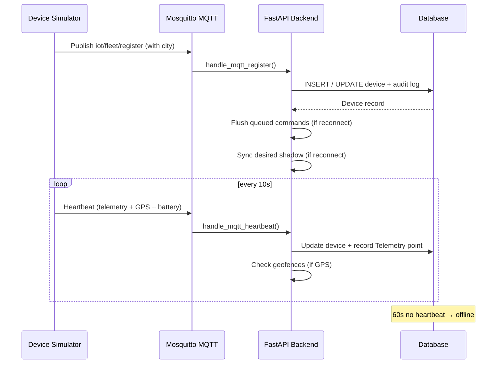

# Fleet Commander — Architecture Diagram

Interactive HTML diagram at `architecture.html`. Open in any browser and click through 12 flows with animated data packets, a side panel showing real payloads, and a dev/prod mode toggle.

---

## Components

| Node | Role | Tech | Port |
|---|---|---|---|
| **User (Browser)** | Dashboard UI | Jinja2 + Tailwind + Chart.js + Leaflet · auto-refresh (5s/10s/15s/30s) + pause-live | localhost:8181 |
| **FastAPI Backend** | Orchestrator — REST + MQTT + Agents + Schedulers | Python · FastAPI · SQLAlchemy async · 100+ routes | :8000 |
| **Aegis Engine** | Auto-remediation — scrape → classify → decide → act | 8 rules · DLQ · dry-run · co-located | scrapes /metrics every 15s |
| **OTA Scheduler** | Scheduled OTA campaigns with blackout windows | Background loop · 30s interval | co-located |
| **Command Queue Flusher** | Delivers queued commands on device reconnect | Background loop · 15s interval | co-located |
| **Telemetry Batch Worker** | Bounded batch commits (200 rows / 1s, shed + counted) | Background loop · leader-only | co-located |
| **Retention Worker** | 24h-hot rollups + tiered expiry (7d default) | Background loop · 10min interval + boot sweep | co-located |
| **ML Registry & Inference** | Seeded IsolationForest, hybrid forest+z scoring, eval gates | scikit-learn · joblib · registry table | scan `?model=auto\|ml\|legacy` |
| **SQLite / PostgreSQL** | Primary datastore — 20 tables (+ Alembic revisions) | Dev: aiosqlite · fleet.db / Prod: asyncpg :5432 | file-based / :5432 |
| **Mosquitto MQTT** | Message broker — heartbeat/obd/bms/status/register/command topics | eclipse-mosquitto:2 · pub/sub · persistence on | :1883 / :8883 mTLS |
| **Device Simulator** | Virtual vehicles (15, VIN profiles, OBD/BMS feeds, fault scenarios) | Python · paho-mqtt · telemetry + GPS + battery + cells | MQTT heartbeat 10s |
| **Prometheus** | Metrics collection — 60+ metrics | v2.53.0 · 7d retention | :9090 |
| **Grafana** | Visualization dashboards | 11.1.0 · pre-provisioned | :3050 (`GRAFANA_PORT`) |
| **Live Fleet Map** | Interactive device location + geofence overlays + vehicle tree | Leaflet 1.9.4 · OpenStreetMap · city-color markers | dashboard embed |
| **Digital Twin view** | Merged asset page: health score, vehicle, risks, alerts, schedules | `GET /twin/{id}` · Twin tab | dashboard embed |
| **Maintenance (Work Orders)** | Alert → work order loop with MTTR | Auto-create on 3rd escalation · manual API | dashboard panel |
| **Alert Channels** | Multi-channel notifications | Slack Webhook · SMTP Email · Generic Webhook | SMTP :587 |
| **Event Emitter** | Outbound webhook fan-out with HMAC signing | Python · requests · async delivery | co-located |

---

## Database Schema (21 Tables + Alembic)

Schema upgrades via `alembic/` revisions (async env); legacy files bootstrapped in code. Telemetry keeps 7 days by default (24h hot raw + 5-min warm rollups).

| Table | Purpose |
|---|---|
| `devices` | Device records (GPS, battery, lifecycle, city, claim_token, VIN/make/model/year) |
| `firmware` | Firmware binaries (SHA256 + Ed25519 signature) |
| `ota_deployments` | OTA deployment tracking (state machine) |
| `ota_schedules` | Scheduled OTA campaigns (Feature 4) |
| `v2g_schedules` | V2G charge/discharge schedules |
| `alerts` | Alert records (dedup, escalation, lifecycle, work_order_id) |
| `user_sessions` | OAuth + admin session tracking (RBAC roles) |
| `telemetry` | Time-series telemetry (tenant/region stamped, dedup unique, OBD + cell summary) |
| `telemetry_5m` | 5-minute warm rollups (retention worker) |
| `geofences` | Geofence definitions (circle/polygon) (Feature 2) |
| `geofence_events` | Geofence enter/exit events (Feature 2) |
| `command_queue` | Offline command buffer (Feature 5) |
| `audit_logs` | Audit trail for all mutating actions (Feature 6) |
| `device_shadows` | Versioned desired/reported states, source/TTL (Feature 7) |
| `predicted_failures` | Predictions with model_version (Feature 3) |
| `ml_models` | Model registry (version, artifact, stage, metrics) |
| `work_orders` | Maintenance tickets linked from alerts (MTTR) |
| `webhook_subscriptions` | Outbound webhook configs (Feature 11) |
| `event_log` | Emitted event delivery tracking (Feature 11) |
| `remediations` | Aegis remediation records |
| `rule_configs` | Aegis rule override configs |

---

## Flows (step-by-step)

### 1. Device Registration & Heartbeat

A device connects to the fleet for the first time or reconnects after being offline.

1. **Simulator → MQTT** — Publishes `iot/fleet/register` with device_id, name, firmware_version, ip_address, city
2. **MQTT → Backend** — `handle_mqtt_register()` upserts the device; if reconnect, flushes queued commands + syncs shadow
3. **Backend → DB** — INSERT (new device) or UPDATE (re-registration); audit log + event emitted
4. **Simulator → MQTT** — Publishes heartbeat every 10s with uptime, signal, EV battery, GPS, CPU/memory/temp telemetry
5. **MQTT → Backend** — `handle_mqtt_heartbeat()` updates device; records telemetry point; checks geofences
6. **Backend → DB** — Device state freshened; 60+ seconds without heartbeat shows device as offline

### 2. OTA Firmware Update with Signing & Rollback

Full lifecycle from firmware upload (with optional Ed25519 signing) through deployment with automatic rollback.

1. **User → Backend** — POST `/ota/upload` with firmware binary; SHA256 + optional Ed25519 signature computed
2. **Backend → DB** — Firmware record persisted with signature fields; audit log written
3. **User → Backend** — POST `/ota/trigger`; OtaDeployment records created; timeout watcher started
4. **Backend → MQTT** — Publishes OTA command with firmware_url, sha256_hash, deployment_id
5. **Simulator → MQTT** — Reports status: downloading → applying → verifying → success or hash_mismatch → rollback
6. **Backend → DB** — Updates deployment + device firmware version (or restores previous on rollback)
7. **Event emitted** — `ota.triggered` event fires to webhook subscribers

### 3. Scheduled OTA with Maintenance Windows

1. **User → Backend** — POST `/ota/schedules` with firmware, target time, blackout hours, canary %
2. **Backend → DB** — Schedule record created with status `scheduled`
3. **Scheduler loop (30s)** — Checks for due schedules; skips if within blackout window
4. **Backend → MQTT** — Publishes OTA commands (canary first, then rest)
5. **Backend → DB** — Schedule marked `completed` with deployment IDs; event emitted

### 4. Telemetry Time-Series, Retention & Predictive Maintenance

1. **Device → MQTT** — Heartbeat + `obd` (event-time, VIN, odometer, fuel, DTCs, PIDs) + `bms` (EV cells) feeds
2. **Backend → DB** — Dedup LRU + odometer guard → bounded batch queue (200 rows/1s) → tenant/region-stamped rows
3. **Retention worker (10m)** — Rolls newly-cold raw into `telemetry_5m`; drops raw + rollups past 7d default
4. **User → Backend** — POST `/predictive/scan?model=auto|ml|legacy`; registry IsolationForest or legacy slopes
5. **Backend → DB** — PredictedFailure records with `model_version`; eval gates (lead ~22–28 steps, FP 0%)
6. **Dashboard** — Device detail modal (Telemetry charts, Twin, Shadow, Lifecycle, Commands); predictive panel with model chips + risk meters; reads >24h come from rollups

### 5. Geofencing & Geo-alerts

1. **User → Backend** — POST `/geofences` creates a circle or polygon geofence
2. **Device → MQTT** — Heartbeat with GPS coordinates
3. **Backend → DB** — `check_device_position()` compares position against all enabled geofences
4. **Backend → DB** — GeofenceEvent created on enter/exit transition
5. **AlertEngine** — Geofence events converted to anomalies → alerts (dedup, notify)
6. **Dashboard** — Geofence circles drawn on Leaflet map; events list in geofence panel

### 6. Offline Command Queue, Device Shadow & Digital Twin

1. **User → Backend** — POST `/commands/queue` for an offline device → status `queued`
2. **Device reconnects** — `handle_mqtt_register()` triggers `_flush_command_queue()`
3. **Backend → MQTT** — Queued commands published; status → `delivered`
4. **Shadow sync** — `_sync_shadow_to_device()` pushes latest desired state on reconnect (versioned writes, 409 on stale base)
5. **Device → MQTT** — V2G status reports create `reported` shadow entries
6. **Twin view** — GET `/twin/{id}` merges health score, vehicle block, risks, alerts, schedules; Twin tab in device detail; vehicle tree beside the map filters + focuses markers

### 7. Fleet Dashboard

The live monitoring UI with auto-refreshing panels, Chart.js charts, Leaflet map + vehicle tree, and modals.

1. **User → Backend** — GET `/` with auth check (Google OAuth or admin); HTML marked `no-store` so deploys never hide behind caches
2. **Backend → User** — Rendered Jinja2 HTML with Tailwind utilities + compiled `/static/app.css?v=<hash>` (content-versioned against edge caches), Chart.js, Leaflet, auto-refresh JS
3. **Dashboard polls** — Devices/table (5s, auto-paused by dialogs), MQTT status (10s), alerts (10s), Aegis (10s), agents (30s), predictions (30s), geofences (60s), schedules (30s), work orders (30s), queue (15s); manual Live/Pause toggle
4. **Device detail modal** — Tabs: Telemetry (Chart.js charts + OBD summary), Twin (health + vehicle + risks), Shadow (versions/sources), Lifecycle, Commands; paginated table (10/page) with persistent selection
5. **Vehicle tree** — Status → city → device hierarchy beside the map; select filters markers, double-click opens details
6. **Prometheus → Grafana** — 60+ metrics scraped every 10s; pre-provisioned dashboards

### 8. Alert Pipeline + Work Orders + Aegis Integration

1. **User → Backend** — GET `/agents/fleet-health` triggers anomaly detection
2. **Backend → DB** — Checks for 8 anomaly types (weak_signal, stuck_ota, ota_failure_spike, mass_offline, device_offline, v2g_revenue_drop, geofence_enter, geofence_exit)
3. **AlertEngine** — Dedup (type + device_id), cooldown (120-3600s), escalation (3× → critical)
4. **Work orders** — 3rd escalation auto-opens a templated ticket linked to the alert; manual open/close API; MTTR histogram; Maintenance panel with one-click close
5. **Channels** — Fans out to Slack, Email, Webhook
6. **Aegis** — Critical anomalies may trigger auto-remediation (8 rules, DLQ, retry)
7. **Dashboard** — Alert panel with acknowledge/resolve/work-order buttons; badge count in header

### 9. Aegis Auto-Remediation

1. **Aegis → Backend** — Scrape loop (15s) polls `/metrics`, parses fleet_* signals
2. **Aegis → Aegis** — Classifies signals; matches against 8 priority-ordered rules (with cooldown)
3. **Aegis → MQTT** — Executes remediation actions (throttle_ota, device_restart, qos_downgrade, etc.)
4. **Aegis → DB** — Records Remediation with input/output snapshots, duration, status
5. **Aegis → Prometheus** — 7 aegis_* metrics updated
6. **Dashboard** — 3-column panel: signals / active / history (auto-refresh 10s)

### 10. Device Lifecycle & Provisioning

1. **Pre-register** — POST `/provisioning/pre-register` creates offline device with claim_token
2. **Bulk import** — POST `/provisioning/bulk-import` (CSV) creates multiple devices with tokens
3. **Claim** — Device claims itself via POST `/lifecycle/claim` with token
4. **Maintenance** — POST `/lifecycle/{id}/maintenance` → MQTT maintenance command
5. **Decommission** — POST `/lifecycle/{id}/decommission` → lifecycle_status = decommissioned
6. **Audit** — Every lifecycle transition logged + Prometheus metric incremented

### 11. OBD & Vehicle Telemetry (P0-A)

1. **Simulator → MQTT** — Register carries VIN/make/model/year; per-beat `obd` (event-time, odometer, fuel, DTCs, tires, PID map) + `bms` (EV cells) topics alongside heartbeats
2. **Backend → DB** — Event-time preserved, QoS-dedupe LRU, odometer-rollback guard; batch queue commit; cell arrays summarized to min/max/spread
3. **DTC decode** — GET `/obd/dtc/{code}` human meanings for tooltips, evidence, runbooks
4. **Twin vehicle block** — GET `/twin/{id}` merges identity, odo, fuel, DTCs, cell health; Twin tab renders it

### 12. AIoT Predict-to-Act Loop (MVP)

1. **Inject** — `SIMULATOR_SCENARIO=thermal|drift|tpms` arms a monotonic fault with known onset
2. **Predict** — POST `/predictive/scan?model=auto` scores trailing-24 windows (registry model or legacy fallback); predictions carry `model_version`
3. **Act** — Alert fires → 3rd escalation auto-opens work order → operator closes with resolution (MTTR)
4. **Verify** — Seeded eval harness (5 tests) + backtest gates: lead ~22–28 steps, FP 0%, legacy 0/10 on tpms
5. **Observe** — Twin view shows health, risks, alerts with WO links; Maintenance panel tracks tickets

---

## Modes

| Aspect | Dev (SQLite) | Prod (PostgreSQL) |
|---|---|---|
| Database | SQLite via aiosqlite | PostgreSQL via asyncpg |
| Connection | file-based (fleet.db) | TCP :5432 |
| Schema upgrades | create_all + frozen bootstraps | Alembic revisions (`alembic/`) |
| Telemetry retention | 7 days default (24h hot raw + rollups) | Same, per-tier growth via config |
| Setup | Default — no extra config | Requires `--profile production` |
| Alert Channels | Slack only | Slack + Email + Webhook |

---

## Workshop Scenarios

1. **"Show me how a device joins the fleet"** — Flow 1: MQTT registration → DB persist → heartbeat → telemetry → geofence check
2. **"What happens when an OTA fails?"** — Flow 2: 20% failure rate → hash_mismatch → automatic rollback
3. **"Can I schedule OTA for off-peak hours?"** — Flow 3: Scheduled OTA with blackout windows + canary
4. **"Can the system predict failures?"** — Flow 4: Telemetry trends → predictive maintenance → risk scores
5. **"How do geofences work?"** — Flow 5: GPS heartbeat → geofence check → enter/exit alerts → map overlay
6. **"What happens when a device is offline?"** — Flow 6: Command queue → reconnect flush → shadow sync
7. **"How does the dashboard stay live?"** — Flow 7: 9 auto-refresh intervals + Chart.js + Leaflet + modals
8. **"How do alerts get to Slack?"** — Flow 8: Anomaly detection → dedup → escalation → multi-channel
9. **"How does Aegis auto-heal the fleet?"** — Flow 9: scrape → classify → decide → act → record → 8 rules
10. **"How do I provision devices at scale?"** — Flow 10: Bulk CSV import → QR-claim → lifecycle management
11. **"Where does vehicle/OBD data flow?"** — Flow 7: VIN register → obd/bms topics → dedup/guards → batch store → twin vehicle block
12. **"Show me the AI loop end to end"** — Flow 8: fault injection → ML prediction → alert → work order → twin
